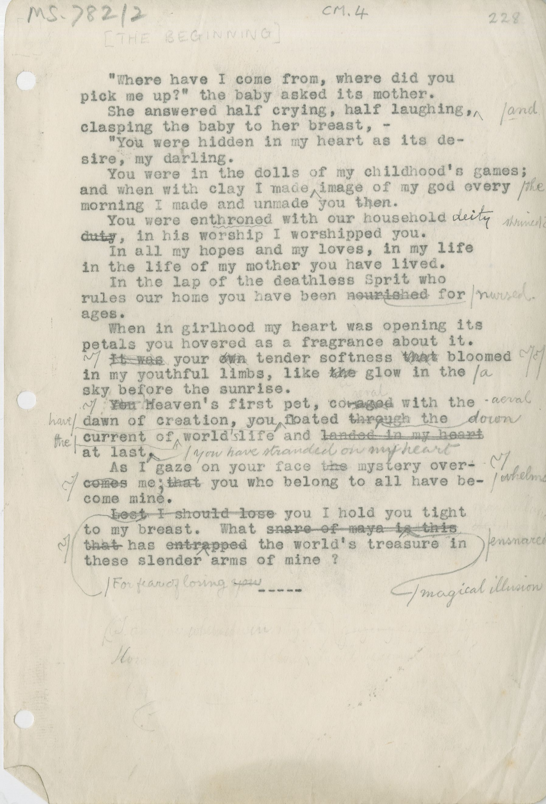

# MS.782/2

[CM.4, \[THE BEGINNING\], 228]

"Where have I come from, where did you pick me up?" the baby asked its mother.
She answered half crying, half laughing, ^and^ clasping the baby to her breast, –
"You were hidden in my heart as its desire, my darling.
You wore in the dolls of my childhood's games; and when with clay I made ^the^ image of my god every morning I made and unmade you then.
You were enthroned with our household ~~duty~~^deity^, in his worship I worshipped you.
In all my hopes and my loves, in my life in the life of my mother you have lived.
In the lap of the deathless Sprit who rules who rules our home you have been ~~nourished~~ ^nursed^ ages.
When in girlhood my heart was opening its petals you hovered as a fragrance about it.
~~It was~~ your ~~own~~ tender softness ~~that~~ bloomed in my youthful limbs, like ~~the~~^a^ glow in the sky before the sunrise.
~~You h~~Heaven's first pet, co ~~-aged~~^aeval^ with the dawn of creation, you floated ~~through~~^down^ the current of ^the^ world^'s^ life and ~~landed in my heart~~ at last ^you^ ^have^ ^stranded^ ^on^ ^my^ ^heart^.
As I gaze on four face ~~the~~ mystery over~~comes~~^whelms^ me^;^ ~~that~~ you who belong to all have become mine.
~~Lest I should lose~~ ^For^ ^fear^ ^of^ ^losing^ ^~~you~~^ I hold you tight to my breast. What ~~snare of maya is this that~~ ^magical^ ^illusion^ has ~~entrapped~~ ^ensnared^ the world's treasure in these slender arms of mine ?

\---

