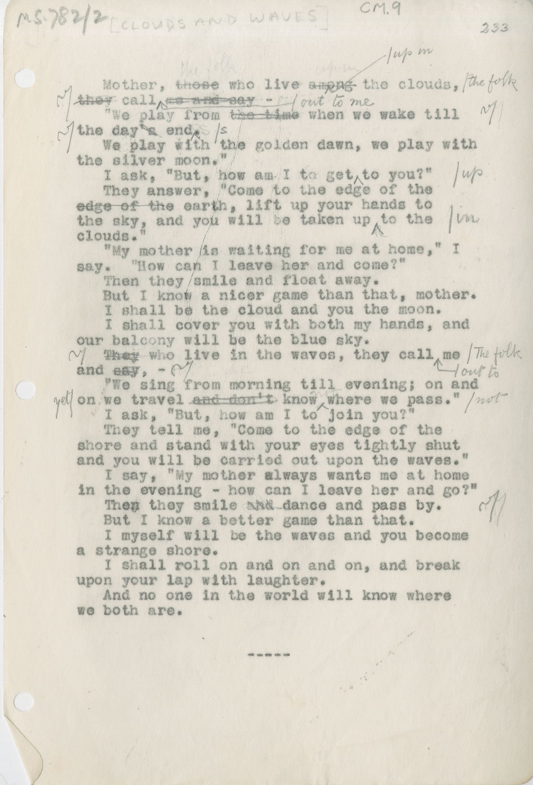

# MS.782/2
## CM.4, [THE LAND OF THE EXILE], 228

Mother, ~~those~~^the folk^ who live ~~among~~^up^ ^in^ the clouds, ~~they~~ call ^out^ ^to^ ^me^ –
"We play from ~~the time~~ when we wake till the day~~'s~~ end^s^.
We play with the golden dawn, we play with the silver moon."
I ask "But how a I to get ^up^ to you?"
They answer, "Come to the edge of the ~~edge of the~~ earth, lift up your hands to the sky, and you will be taken up ^in^ to the clouds."
"My mother is waiting for me at home," I say. "How can I eave her and come?"
Then they smile and float away.
But I know a nicer game than that, mother.
I shall be the cloud and you the moon.
I shall cover you with both my hands, and our balcony will be the blue sky.
~~They~~^The folk^ who live in the waves, they call ^out^ ^to^ me and ~~say~~, –
"We sing from morning till evening; on and on we travel ~~and don't~~^yet^ know ^not^ where we pass."
I ask, "But, how am I to join you?"
They tell me, "Come to the edge of the shore and stand with your eyes tightly shut and you will be carried out upon the waves."
I say, "My mother always wants me at home in the evening – how can I leave her and go?"
Then they smile ~~and~~ dance and pass by.
But I know a better game than that.
I myself will be the waves and you become a strange shore.
I shall roll on and on and on, and break upon your lap with laughter.
And no one in the world will know where we both are.

\-----

