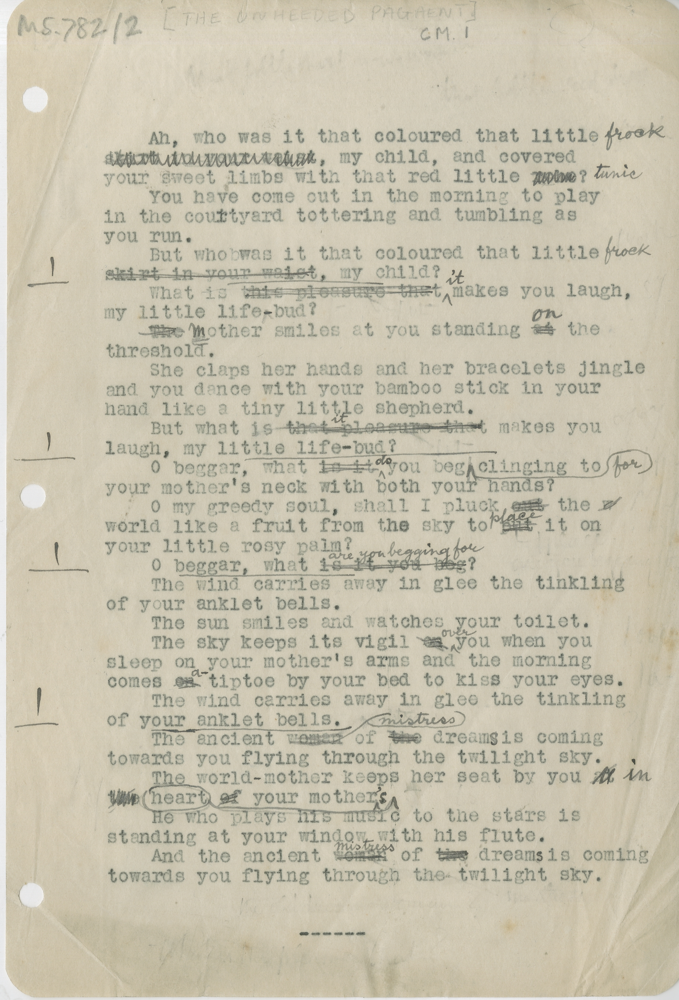

Ah, who was it that coloured that little ^frock^ ~~skirt in your waist~~, my child, and covered your sweet limbs with that red little ~~robe~~? ^tunic^ 

You have come out in the morning to play in the courtyard tottering and tumbling as you run.

But whobwas it that coloured that little ^frock^ ~~skirt in your waist~~, my child?

What is ~~this pleasure that~~ ^it^ makes you laugh, my little life^-^bud?

~~The~~ mother smiles at you standing ~~at~~ ^on^ the threshold.

She claps her hands and her bracelets jingle and you dance with your bamboo stick in your hand like a tiny little shepherd.

But what ~~is it~~ ^do^ you beg ^for^ clinging to your mother's neck with both your hands?

O my greedy soul, shall I pluck ~~out~~ the world like a fruit from the sky to ~~put~~ ^place^ it on your little rosy palm?

O beggar, what ~~is it you beg~~ ^are you begging for^?

The wind carries away in glee the tinkling of your anklet bells.

The sun smiles and watches your toilet.

The sky keeps its vigil ~~on~~ ^over^ you when you sleep on your mother's arms and the morning comes ~~on~~ ^a^ tiptoe by your bed to kiss your eyes.

The wind carries away in glee the tinkling of your anklet bells.

The ancient ~~woman~~ ^mistress^ of ~~the~~ dreams is coming towards you flying through the twilight sky.

The world-mother keeps her seat by you ~~at~~ ^in^ ~~the heart of~~ your mother ^'s^ ^heart^

He who plays his music to the stars is standing at your window with his flute.

And the ancient ~~woman~~ ^mistress^ of ~~the~~ dream^s^ is coming towards you flying through the twilight sky.

