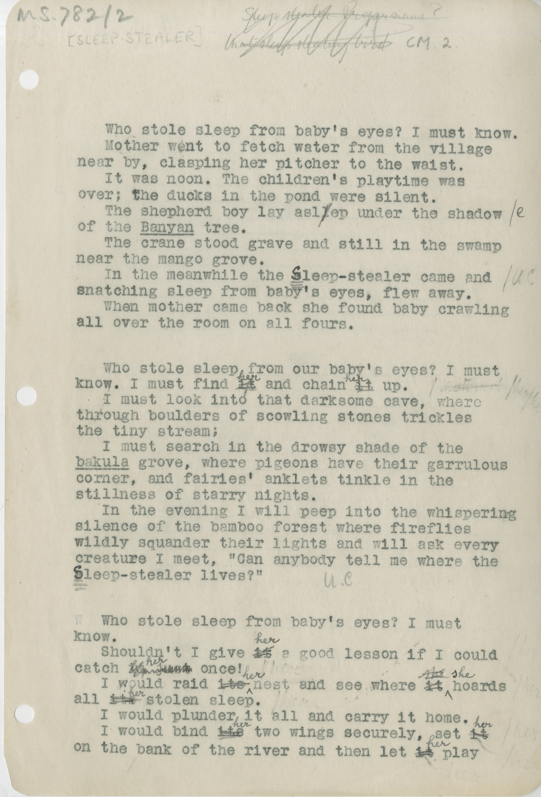

# MS 782_2-003

~~Sleep stealer Performance?~~
~~that sleep stealing bed~~[^1]
[^1]:Marginalium in Tagore's hand

&nbsp;Who stole sleep from baby's eyes?  I must know.
&nbsp;Mother went to fetch water from the village
near by, clasping her pitcher to the waist.
&nbsp;It was noon.  The children's playtime was
over; the ducks in the pond were silent.
&nbsp;The shepherd boy lay asl~~l~~ep under the shadow
of the ++Banyan++ tree.
&nbsp; The crane stood grave and still in the swamp
near the mango grove.
&nbsp; In the meanwhile the ~~s~~leep-stealer came and /UC
snatching sleep from the baby's eyes, flew away.
&nbsp; When mother came back she found baby crawling
all over the room on all fours.

&nbsp; Who stole sleep from our baby's eyes? I must
know. I must find ~~it~~^her^ and chain ~~it~~^her^ up.
&nbsp; I must look into that darksome cave, where
through boulders of scowling stones tricks
the tiny stream;
&nbsp; I must seach in the drowsy shade of the
++bakula++ grove, where pigeons have their garrulous
corner, and fairies' anklets tinkle in the
stillness of starry nights.
&nbsp; In the evening I will peep into the whispering
silence of the bamboo forest where fireflies
wildly squander their lights and will ask every
creature I meet, "Can anybody tell me where the
~~s~~leep-stealer lives?"

&nbsp; Who stole sleep from baby's eyes? I must
know.
&nbsp; Shouldn't I give ~~it~~^her^ a good lesson if I could
catch ~~it just~~^her^ once!
&nbsp; I would raid ~~its~~^her^ nest and see where ~~it~~^she^ hoards
all ~~its~~^her^ stolen sleep.
&nbsp; I would plunder it all and carry it home.
&nbsp; I would bind ~~its~~^her^ two wings securely, set ~~it~~^her^
on the bank fo the river and then let ~~it~~^her^ play

