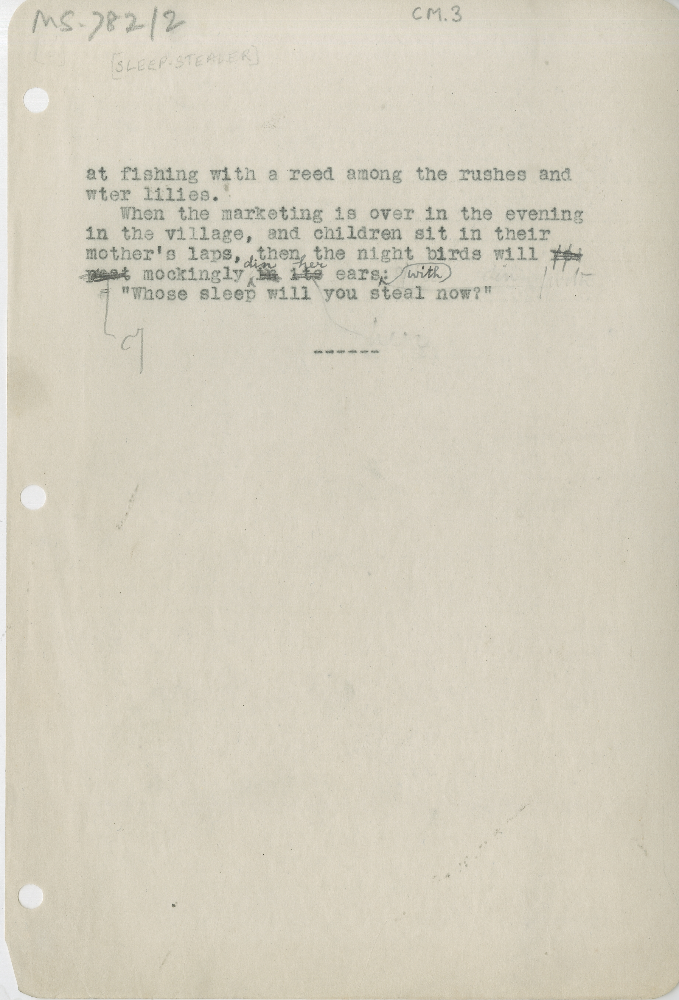

at fishing with a reed among the rushes and \
wter lilies.  \
    When the marketing is over in the evening  \
in the village, and children sit in their \
mother's laps, then the night birds will ~~re-~~\
~~peat~~ mockingly ~~in its~~ ^in^ ^its^ ears ^with^: \
    "Whose sleep will you steal now?" 

