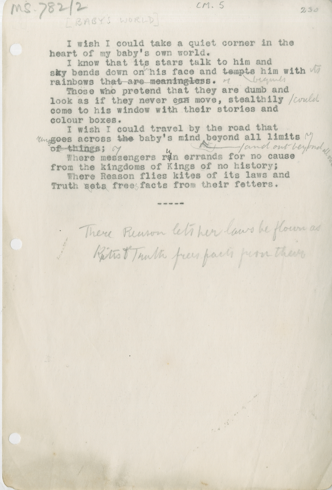

# CM.06 BABY'S WORLD 
&nbsp;&nbsp;&nbsp;&nbsp;&nbsp;&nbsp;I wish I could take a quiet corner in the 
heart of my baby’s own world.
&nbsp;&nbsp;&nbsp;&nbsp;&nbsp;&nbsp; I know that its stars talk to him and
sky bends down on ^to^ his face and ~~tempts~~ ^beguiles^ him with ^its^
rainbows ~~that are meaningless~~.
&nbsp;&nbsp;&nbsp;&nbsp;&nbsp;&nbsp;Those who pretend that they are dumb and 
look as if they never ~~can~~ ^\could^ move, stealthily
come to his window with their stories and
colour boxes.
&nbsp;&nbsp;&nbsp;&nbsp;&nbsp;&nbsp;I wish I could travel by the road that
^runs^ ~~goes~~ across ~~the~~ baby’s mind ^ beyond all limits
&nbsp;&nbsp;&nbsp;&nbsp;&nbsp;&nbsp;&nbsp;&nbsp;&nbsp;&nbsp;&nbsp;&nbsp;&nbsp; ^and^ ^out^ ^beyond^ ^all^ ^our^
~~of things~~;
&nbsp;&nbsp;&nbsp;&nbsp;&nbsp;&nbsp;Where messengers r~~a~~^u^n errands for no cause
from the kingdoms of Kings of no history
&nbsp;&nbsp;&nbsp;&nbsp;&nbsp;&nbsp;Where Reason flies kites of its laws and
Truth ~~sets~~ free^s^ facts from their fetters.
&nbsp;&nbsp;&nbsp;&nbsp;&nbsp;&nbsp;&nbsp;&nbsp;&nbsp;&nbsp;&nbsp;&nbsp;&nbsp;&nbsp;&nbsp;&nbsp;&nbsp;&nbsp;&nbsp;&nbsp;&nbsp;&nbsp;&nbsp;&nbsp;&nbsp;&nbsp;&nbsp;&nbsp;&nbsp;&nbsp;&nbsp;&nbsp;-----

&nbsp;&nbsp;&nbsp;&nbsp;&nbsp;&nbsp;&nbsp;&nbsp;&nbsp;&nbsp;There Reason lets her laws be flown as
&nbsp;&nbsp;&nbsp;&nbsp;&nbsp;&nbsp;&nbsp;&nbsp;&nbsp;&nbsp;Kites * Truth frees facts from their [^1]
[^1]: Additional lines written out beneath manuscript text in pencil, presumably as a suggestion for replacing the last few lines. 

