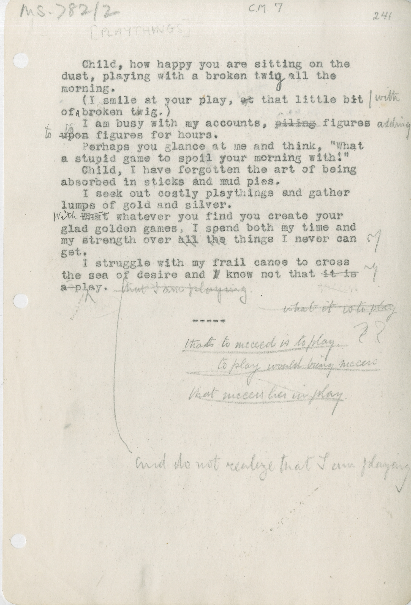

# MS 782/2

[CM 7, folio 241]

Child, how happy you are sitting on the \
dust, playing with a broken twig all the \
morning.

(I smile at your play, ~~at~~ ^with^ that little bit \
of ^a^ broken twig.)

I am busy with my accounts, ~~piling~~ ^adding^ figures \
~~upon~~ ^to^ figures for hours.

Perhaps you could glance at me and think, "What \
a stupid game to spoil your morning with!"

Child, I have forgotten the art of being \
absorbed in sticks and mud pies.

I seek out costly playthings and gather \
lumps of gold and silver.

~~What~~ \^With\^ whatever you find you create your \
glad golden games, I spend both my time and \
my strength over ~~all~~ ~~the~~ things I never can get.

I struggle with my frail canoe to cross \
the sea of desire and ~~I~~ know not that ~~it is~~ \
~~a play~~ \^ ~~that I am playing.~~ \^and do not realize that I am playing

~~what it is to play~~

\---

that to succeed is to play. ? ?

to play would bring success[?]

that success lies in play.

