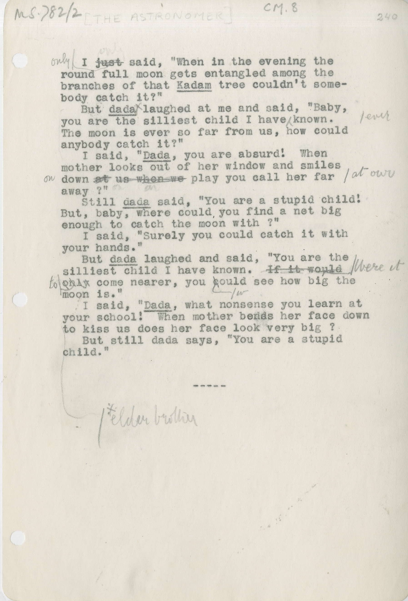

# CM.09 THE ASTRONOMER 
&nbsp;&nbsp;&nbsp;&nbsp;&nbsp;&nbsp;I ~~just~~ ^only^ said, “When in the evening the
round full moon gets entangled among the
branches of that ++Kadam++ tree couldn’t some-
body catch it?”
&nbsp;&nbsp;&nbsp;&nbsp;&nbsp;&nbsp;But ++dada++^+^ laughed at me and said, “Baby,
you are the silliest child I have ^ever^ known.
The moon is ever so far from us, how could
anybody catch it?”
&nbsp;&nbsp;&nbsp;&nbsp;&nbsp;&nbsp;I said, &quot;++Dada++, you are absurd! When
mother looks out of her window and smiles
down ~~at~~^on^ us ~~when we~~ ^at^ ^our^ play you call her far
away?""
&nbsp;&nbsp;&nbsp;&nbsp;&nbsp;&nbsp;Still ++dada++ said, “You are a stupid child!
But, baby, where could you find a net big
enough to catch the moon with?”
&nbsp;&nbsp;&nbsp;&nbsp;&nbsp;&nbsp;I said, “Surely you could catch it with
your hands.”
&nbsp;&nbsp;&nbsp;&nbsp;&nbsp;&nbsp;But ++dada++ laughed and said, “You are the
silliest child I have known. ~~If it would~~^Were^ ^it^
^to^ ~~only~~ come nearer, you ~~c~~^w^ould see how big the
moon is.”
&nbsp;&nbsp;&nbsp;&nbsp;&nbsp;&nbsp;I said, &quot;++Dada++, what nonsense you learn at
your school! When mother bends her face down
to kiss us does her face look very big?
&nbsp;&nbsp;&nbsp;&nbsp;&nbsp;&nbsp;But still dada says, “You are a stupid
child.”
&nbsp;&nbsp;&nbsp;&nbsp;&nbsp;&nbsp;&nbsp;&nbsp;&nbsp;&nbsp;&nbsp;&nbsp;&nbsp;&nbsp;&nbsp;&nbsp;&nbsp;&nbsp;&nbsp;&nbsp;&nbsp;&nbsp;&nbsp;&nbsp;&nbsp;&nbsp;&nbsp;&nbsp;&nbsp;&nbsp;&nbsp;&nbsp;&nbsp;&nbsp;&nbsp;&nbsp;&nbsp;-----
+elder brother[^1]

[^1]:Annotation on manuscript, translating ‘dada’. 

