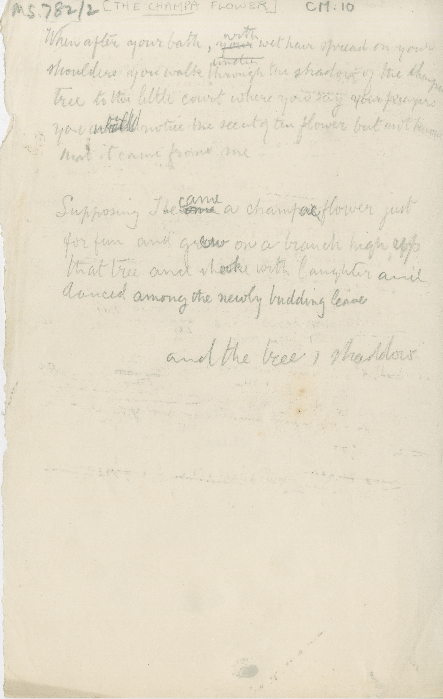

When after your bath, ~~your~~ ^with^ wet hair spread on you  \
shoulders you walk ~~under~~ through the shadow of the champa  \
tree to the little court where you say your prayers  \
you would notice the scent of the flower but not know  \
that it came from me  

Supposing I became a champa flower just  \
for fun and grow on a branch high up  \
that tree and look with laughter and  \
danced among the newly budding leave

