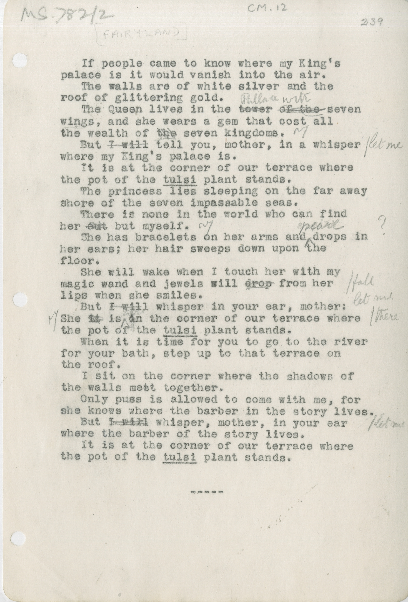

[FAIRYLAND]
&nbsp; If people came to knwo where my King's
palace is it would vanish into the air.
&nbsp; The walls are of white sliver and the
roof of glittering gold. 
&nbsp; The Queen lives in the ~~tower of the~~^Pallace with seven
wings, and she wears a gem that cost all
the wealth of ~~the~~ seven kingdoms.
&nbsp; But ~~I will~~ tell you, mother, in a whisper \/let me
where my King's palace is. 
&nbsp; It is at teh corner of our terrace where
the pot of the ++tulsi++ plant stands.
&nbsp; The princess lies sleeping on the far away
shore of the seven impassable seas.
&nbsp; There is none in the world who can find
her ~~out~~ but myself. 
&nbsp; She has bracelets on her arms and ^pearl^ drops in 
her ears; her hair sweeps down upon the
floor.
&nbsp; She will wake when I touch her with my
magic wand and jewels will ~~drop~~ from her \/fall
lips when she smiles.
&nbsp; But ~~I will~~ whisper in our ear, mother let me
She ~~it~~ is ^there^ in the cormer of our terrace where \/there
the pot of the ++tulsi++ plant stands. 
&nbsp; When it is time for you to go to the river
for your bath, step up to that terrace on 
the roof. 
&nbsp; I sit on the corner where the shadows of 
the walls meet together.
&nbsp; Only puss is allowed to come with me, for 
she knows where the barber in the story lives.
&nbsp; But ~~I will~~ whisper, mother, in your ear \/let me
where the barber of the story lives.
&nbsp; It is at the corner of our terrace where
the pot of the ++tulsi++ plant stands.
&nbsp; -----

  
