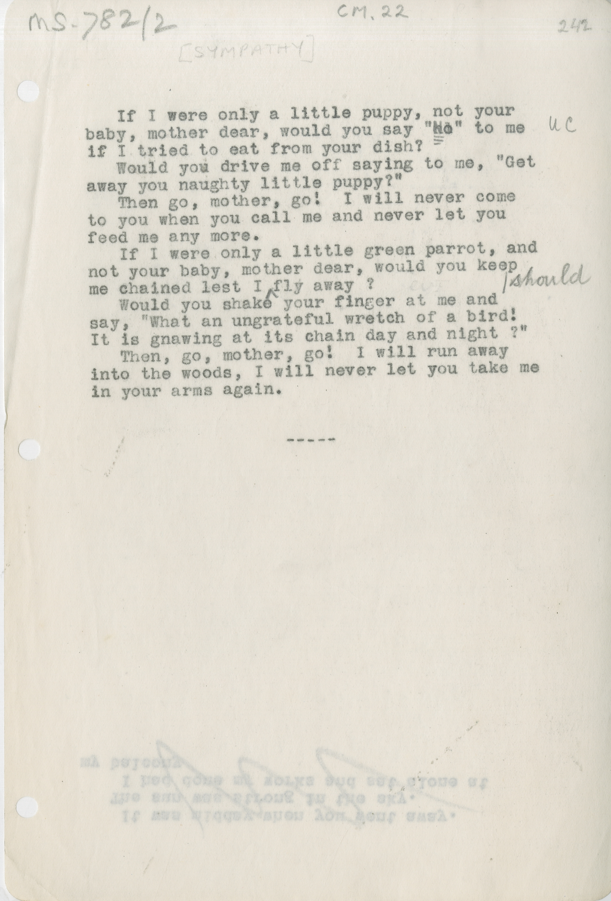

MS.782/2 CM.22 [SYMPATHY] 

&nbsp;&nbsp;&nbsp;&nbsp;&nbsp;If I were only a little puppy, not you \
baby, mother dear, would you say "~~n~~^N^o" to me ?? \
if I tried to eat from your dish? \
&nbsp;&nbsp;&nbsp;&nbsp;&nbsp;Would you drive me off saying to me, "Get \
away you naughty little puppy?" \
&nbsp;&nbsp;&nbsp;&nbsp;&nbsp;Then go, mother, go! I will never come \
to you when you call me and never let you \
feed me any more. \
&nbsp;&nbsp;&nbsp;&nbsp;&nbsp;If I were only a little green parrot, and \
not your baby, mother dear, would you keep \
me chained lest I ^should^ fly away? \
&nbsp;&nbsp;&nbsp;&nbsp;&nbsp;Would you shake your finger at me and \
say, "What an ungrateful wretch of a bird! \
It is gnawing at its chains day and night ?" \
&nbsp;&nbsp;&nbsp;&nbsp;&nbsp;Then, go, mother, go!  I will run away \
into the woods, I will never let you take me \
in you arms again.

