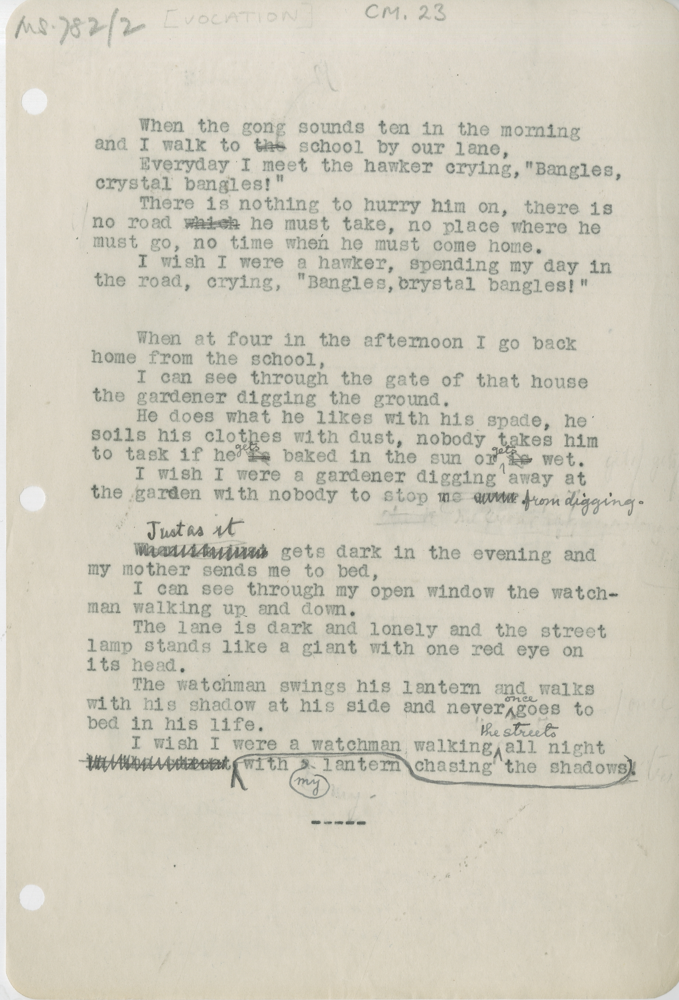

MS.782/2 [VOCATION] CM.23 \
&nbsp;&nbsp;&nbsp;&nbsp;&nbsp;When the gong sounds ten in the morning \
and I walk to ~~the~~ school by our lane, \
&nbsp;&nbsp;&nbsp;&nbsp;&nbsp;Everyday I meet the hawker crying, "Bangles, \
crystal bangles!" \
&nbsp;&nbsp;&nbsp;&nbsp;&nbsp;There is nothing to hurry him on, there is \
no road ~~which~~ he must take, no place where he \
must go, no time when he must come home. \
&nbsp;&nbsp;&nbsp;&nbsp;&nbsp;I wish I were a hawker, spending my day in \
the road, crying, "Bangles, crystal bangles!"

&nbsp;&nbsp;&nbsp;&nbsp;&nbsp;When at four in the afternoon I go back \
home from the school, \
&nbsp;&nbsp;&nbsp;&nbsp;&nbsp;I can see through the gate of that house \
the gardener digging the ground. \
&nbsp;&nbsp;&nbsp;&nbsp;&nbsp;He does what he likes with his spade, he \
soils his clothes with dust, nobody takes him \
to task if he ~~is~~ ^gets^ baked in the sun or ~~is~~ ^gets^ wet. \
&nbsp;&nbsp;&nbsp;&nbsp;&nbsp;I wish I were a gardener digging away at \
the garden with nobody to stop me ~~??~~ ^from^ ^digging^. 

&nbsp;&nbsp;&nbsp;&nbsp;&nbsp;~~??~~ ^Just^ ^as^ ^it^ gets dark in the evening and \
my mother sends me to bed, \
&nbsp;&nbsp;&nbsp;&nbsp;&nbsp;I can see through my open window the watch- \
man walking up and down. \
&nbsp;&nbsp;&nbsp;&nbsp;&nbsp;The lane is dark and lonely and the street \
lamps stands like a giant with one red eye on \
its head. \
&nbsp;&nbsp;&nbsp;&nbsp;&nbsp;The watchman swings his lantern and walks \
with his shadow at his side and never ^once^ goes to \
bed in his life. \
&nbsp;&nbsp;&nbsp;&nbsp;&nbsp;I wish I were a watchman walking ^in^ ^the^ ^streets^ all night \
~~??~~ with ^my^ lantern chasing the shadows. ***

