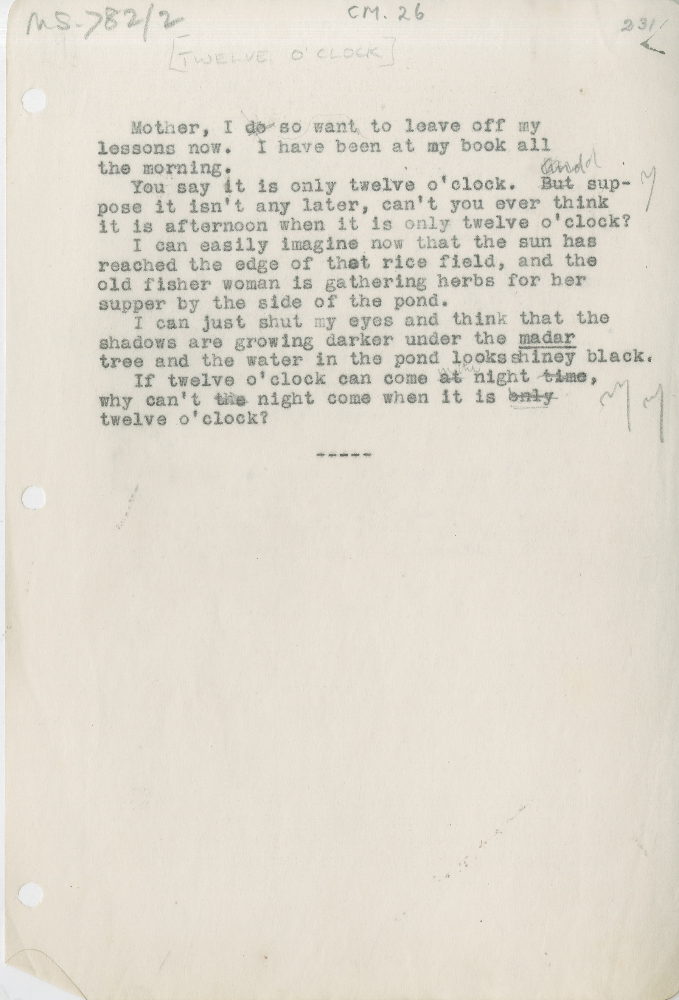

MS.782/2 [TWELVE O' CLOCK] CM.26

&nbsp;&nbsp;&nbsp;&nbsp;&nbsp;Mother, I ~~do~~ so want to leave off my \
lessons now. &nbsp;&nbsp;I have been at my book all \
the morning. \
&nbsp;&nbsp;&nbsp;&nbsp;&nbsp;You say it is only twelve o'clock. ~~But~~ ^And?^ sup- \
pose it it isn't any later, can't you ever think \
it is afternoon when it is only twelve o'clock? \
&nbsp;&nbsp;&nbsp;&nbsp;&nbsp;I can easily imagine now that the sun has \
reached the edge of that rice field, and the \
old fisher woman is gathering herbs for her \
supper by the side of the pond. \
&nbsp;&nbsp;&nbsp;&nbsp;&nbsp;I can just shut my eyes and think that the \
shadows are growing darker under the madar \
tree and the water in the pond lookes shiney black. \
&nbsp;&nbsp;&nbsp;&nbsp;&nbsp;If twelve o'clock can come ~~at~~ in the night ~~time~~, \
why can't ~~the~~ night come when it is ~~only~~ \
twelve o'clock? 

