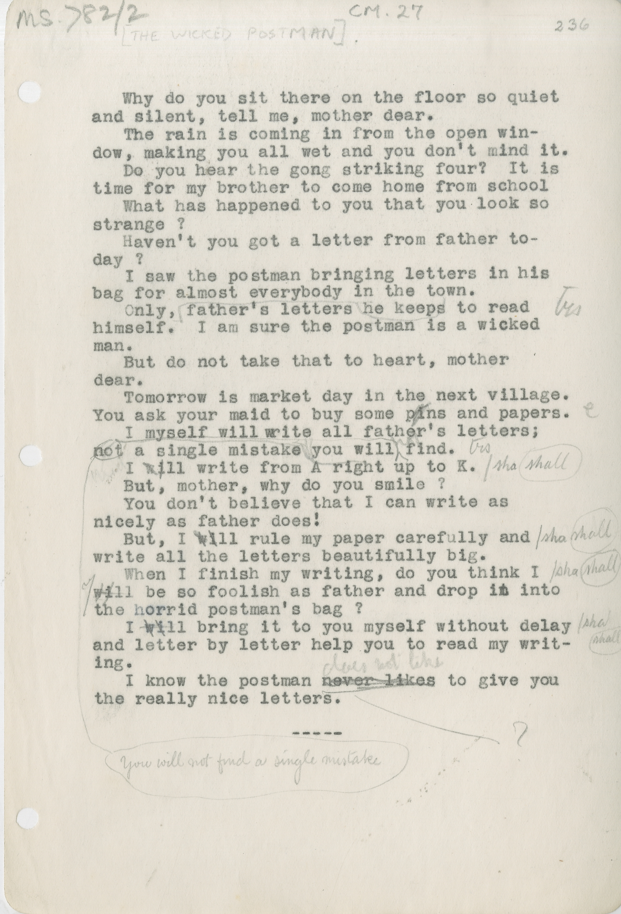

MS.782/2 [THE WICKED POSTMAN]. CM.27

&nbsp;&nbsp;&nbsp;&nbsp;&nbsp;Why do you sit there on the floor so quiet \
and silent, tell me, mother dear. \
&nbsp;&nbsp;&nbsp;&nbsp;&nbsp;The rain is coming in from the open win- \
dow, making you all wet and you don't mind it. \
&nbsp;&nbsp;&nbsp;&nbsp;&nbsp;Do you hear the gong striking four? It is \
time for my brother to come home from school \
&nbsp;&nbsp;&nbsp;&nbsp;&nbsp;What has happened to you that you look so \
strange? \
&nbsp;&nbsp;&nbsp;&nbsp;&nbsp;Haven't you got a letter from father to- \
day ? \
&nbsp;&nbsp;&nbsp;&nbsp;&nbsp;I saw the postman bringing letters in his \
bag for almost everybody in the town. \
&nbsp;&nbsp;&nbsp;&nbsp;&nbsp;Only, he keeps father's letters to read \
himself. I am sure the postman is a wicked \
man. \
&nbsp;&nbsp;&nbsp;&nbsp;&nbsp;But do not take that to heart, mother \
dear. 
&nbsp;&nbsp;&nbsp;&nbsp;&nbsp;Tomorrow is market day in the next village. \
You ask your maid to buy some p~~i~~^e^ns and papers. \
&nbsp;&nbsp;&nbsp;&nbsp;&nbsp;I myself will write all father's letters; \
~~not a single mistake you will find~~ ^you^ ^will^ ^not^ ^find^ ^a^ ^single^ ^mistake^. \
&nbsp;&nbsp;&nbsp;&nbsp;&nbsp;I ~~will~~ ^shall^ write from A right up to K. \
&nbsp;&nbsp;&nbsp;&nbsp;&nbsp;But, mother, why do you smile ? \
&nbsp;&nbsp;&nbsp;&nbsp;&nbsp;You don't believe that I can write as \
nicely as father does! \
&nbsp;&nbsp;&nbsp;&nbsp;&nbsp;But, I ~~will~~ ^shall^ rule my paper carefully and \
write all the letters beautifully big. \
&nbsp;&nbsp;&nbsp;&nbsp;&nbsp;When I finish my writing, do you think I \
~~will~~ ^shall^ be so foolish as father and drop i~~n~~^t^ into \
the horrid postman's bag ? \
&nbsp;&nbsp;&nbsp;&nbsp;&nbsp;I ~~will~~ ^shall^ bring it to you myself without delay \
and letter by letter help you to read my writ-\
ing. \
&nbsp;&nbsp;&nbsp;&nbsp;&nbsp;I know the postman ~~never likes~~ ^does^ ^not^ ^like^ to give you \
the really nice letters.

