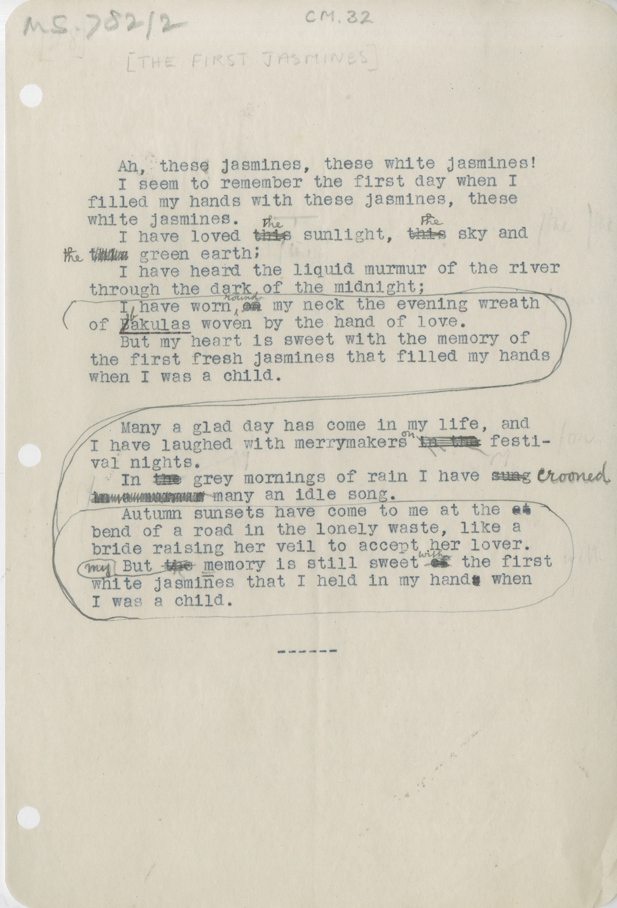

# MS 782/2 

[CM 32]

&nbsp;&nbsp;&nbsp;&nbsp;&nbsp;Ah, these jasmines, these white jasmines! \
&nbsp;&nbsp;&nbsp;&nbsp;&nbsp;I seem to remember the first day when I \
filled my hands with these jasmines, these \
white jasmines. \
&nbsp;&nbsp;&nbsp;&nbsp;&nbsp;I have loved ~~this~~ ^the^ sky and \
~~this~~ ^the^ green earth; \
&nbsp;&nbsp;&nbsp;&nbsp;&nbsp;I have heard the liquid murmur of the river \
through the dark of the midnight; \
&nbsp;&nbsp;&nbsp;&nbsp;&nbsp;*Autumn sunsets have come to me at the ~~at~~ \
bend of a road in the lonely waste, like a \
bride raising her veil to accept her lover. \
But ~~the~~ ^my^ memory is still sweet ~~of~~ ^with^ the first \
white jasmines that I held in my hand~~s~~ when \
I was a child.* [^1] \
&nbsp;&nbsp;&nbsp;&nbsp;&nbsp;I have worn ~~on~~ ^round^ my neck the evening wreath \
of ~~B~~^b^akulas woven by the hand of my love. \
&nbsp;&nbsp;&nbsp;&nbsp;&nbsp;But my heart is sweet with the memory of \
the first fresh jasmines that filled my hands \
when I was a child. 

&nbsp;&nbsp;&nbsp;&nbsp;&nbsp;Many a glad day has come in my life, and \
I have laughed with merrymakers ~~in the~~ ^on^ festi- \
val nights. \
&nbsp;&nbsp;&nbsp;&nbsp;&nbsp;In ~~the~~ grey mornings of rain I have ~~sung~~ ^crooned^ \
~~in a murmur~~ many an idle song. 

[^1]: my? note: from asterisk to asterisk was originally at the end but was moved.

