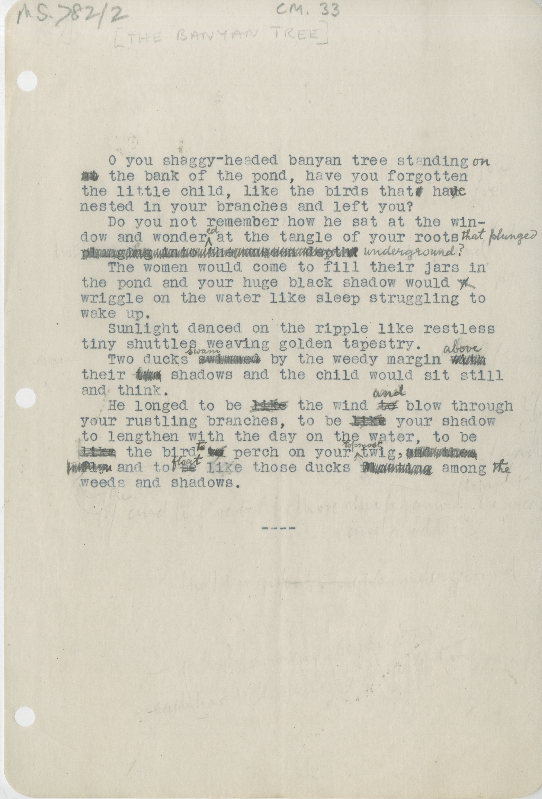

# MS 782/2

[CM 33]

&nbsp;&nbsp;&nbsp;&nbsp;&nbsp;O you shaggy-headed banyan tree standing ^on^ \
~~at~~ the bank of the pond, have you forgotten \
the little child, like the birds that ~~??~~ ha ~~??~~^ve^ \
nested in your branches and left you? \
&nbsp;&nbsp;&nbsp;&nbsp;&nbsp;Do you not remember how he sat at the win- \
dow and wonder^ed^ at the tangle of your roots ^that^ ^plunged^ \
~~plunging into the unseen depth~~ ^underground?^ \
&nbsp;&nbsp;&nbsp;&nbsp;&nbsp;The women would come to fill their jars in \
the pond and your huge black shadow would ~~w~~ \
wriggle on the water like sleep struggling to \
wake up. \
&nbsp;&nbsp;&nbsp;&nbsp;&nbsp;Sunlight danced on the ripple like restless \
tiny shuttles weaving golden tapestry. \
&nbsp;&nbsp;&nbsp;&nbsp;&nbsp;Two ducks ~~swimmed~~ ^swam^ by the weedy margin ~~with~~ ^above^ \
their shadows and the child would sit still \
and think. \
&nbsp;&nbsp;&nbsp;&nbsp;&nbsp;He longed to be ~~like~~ the wind ~~to~~ ^and^ blow through \
your rustling branches, to be ~~like~~ your shadow \
to lengthen with the day on the water, to be \
~~like~~ the bird ~~??~~ ^to^ perch on your ^top^ ^most^ twig, ~~and then~~ \
~~fly~~ and to ~~be~~ ^float^ like those ducks ~~floating~~ among ^the^ \
weeds and shadows.

