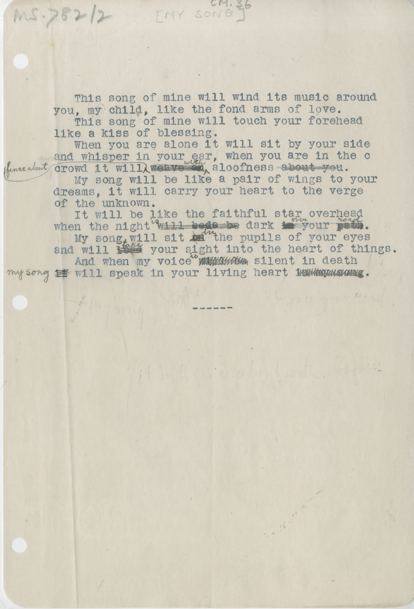

# MS 782/2 

[CM 36] 

&nbsp;&nbsp;&nbsp;&nbsp;&nbsp;This song of mine will wind its music around \
you, my child, like the fond arms of love. \
&nbsp;&nbsp;&nbsp;&nbsp;&nbsp;This song of mine will touch your forehead \
like a kiss of blessing. \
&nbsp;&nbsp;&nbsp;&nbsp;&nbsp;When you are alone it will sit by your side \
and whisper in your ear, when you are in the c \
crowd it will ^??^ ^about^ ~~weave on~~ ^with^ aloofness ~~about you~~. \
&nbsp;&nbsp;&nbsp;&nbsp;&nbsp;My song will be like a pair of wings to your \
dreams, it will carry your heart to the verge \
of the unknown. \
&nbsp;&nbsp;&nbsp;&nbsp;&nbsp;It will be like the faithful star overhead \
when the night ^is^ ~~will bode? be~~ dark ~~in~~ ^over^ your ~~path~~ ^head?^. \
&nbsp;&nbsp;&nbsp;&nbsp;&nbsp;My song will sit ~~on~~ ^in^ the pupils of your eyes \
and will ~~lead~~ ^take^ your sight into the heart of things. \
&nbsp;&nbsp;&nbsp;&nbsp;&nbsp;And when my voice ~~will be~~ ^is^ silent in
death \
~~it~~ ^my^ ^song^ will speak in your living heart ~~in my soul~~.

