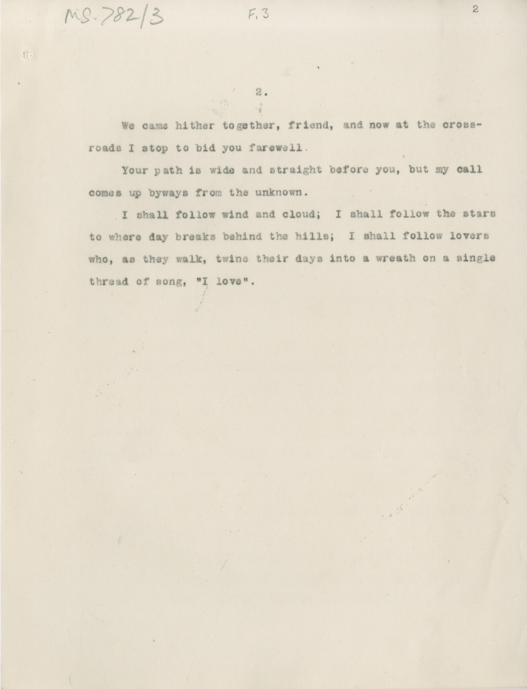

# MS 782/3

[F 3] 

2. 
&nbsp;&nbsp;&nbsp;&nbsp;&nbsp;We came hither together, friend, and now at the cross- \
roads I stop to bid you farewell. \
&nbsp;&nbsp;&nbsp;&nbsp;&nbsp;Your path is wide and straight before you, but my call \
comes up byways from the unknown. \
&nbsp;&nbsp;&nbsp;&nbsp;&nbsp;I shall follow wind and cloud; I shall follow the stars \
to where day breaks behind the hills; I shall follow lovers \
who, as they walk, twine their days into a wreath on a single \
thread of song, "I love".

