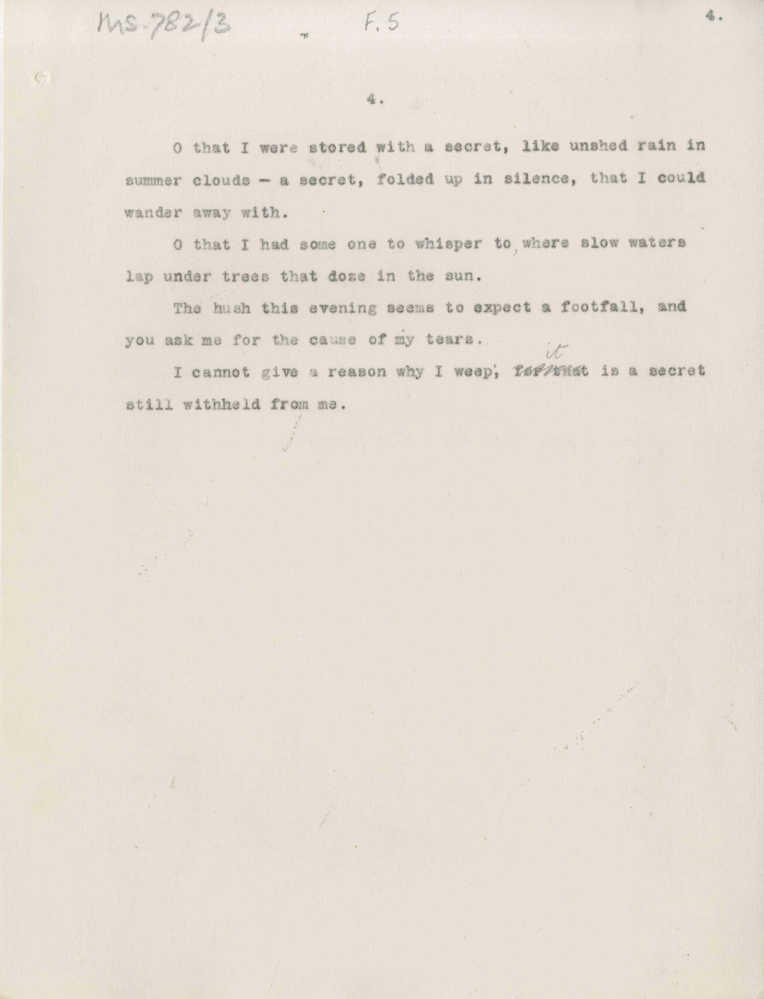

# MS 782/3

[F 5]

4.
&nbsp;&nbsp;&nbsp;&nbsp;&nbsp;O that I were stored with a secret, like unshed rain in \
summer clouds - a secret, folded up in silence, that I could \
wander away with. \
&nbsp;&nbsp;&nbsp;&nbsp;&nbsp;O that I had some one to whisper to where slow waters \
lap under trees that doze in the sun. \
&nbsp;&nbsp;&nbsp;&nbsp;&nbsp;The hush this evening seems to expect a footfall, and \
you ask me for the cause of my tears. \
&nbsp;&nbsp;&nbsp;&nbsp;&nbsp;I cannot give a reason why I weep; ~~for that~~ ^it^ is a secret \
still withheld from me. 

