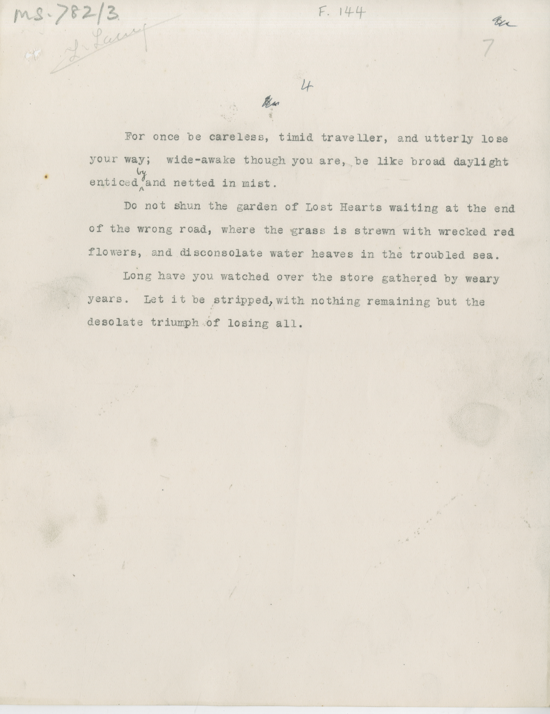

# MS 782/3

[F 144]

~~5.~~ ^4^ \
[^1]
&nbsp;&nbsp;&nbsp;&nbsp;&nbsp;For once be careless, timid traveller, and utterly lose \
your way; wide-awake though you are, be like broad daylight \
enticed ^by^ and netted in mist. \
&nbsp;&nbsp;&nbsp;&nbsp;&nbsp;Do not shun the garden of Lost Hearts waiting at the end \
of the wrong road, where the grass is strewn with wrecked red \
flowers, and disconsolate water heaves in the troubled sea. \
&nbsp;&nbsp;&nbsp;&nbsp;&nbsp;Long have you watched over the store gathered by weary \
years. Let it be stripped^,^ with nothing remaining but the \
desolate triumph of losing all. 
[^1]: pencil note at the top 

