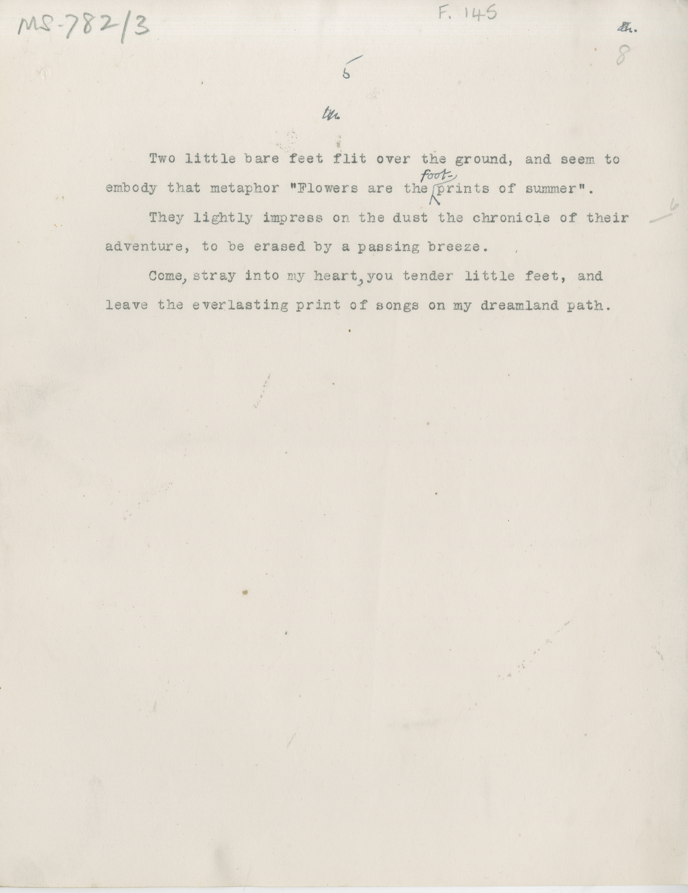

# MS 782/3

[F 145]

~~6.~~ ^5^ \
&nbsp;&nbsp;&nbsp;&nbsp;&nbsp;Two little bare feet flit over the ground, and seem to \
embody that metaphor "Flowers are the ^foot-^ prints of summer". \
&nbsp;&nbsp;&nbsp;&nbsp;&nbsp;They lightly impress on the dust the chronicle of their \
adventure, to be erased by a passing breeze. \
&nbsp;&nbsp;&nbsp;&nbsp;&nbsp;Come ^,^ stray into my heart ^,^ you tender little feet, and \
leave the everlasting print of songs on my dreamland path. 

