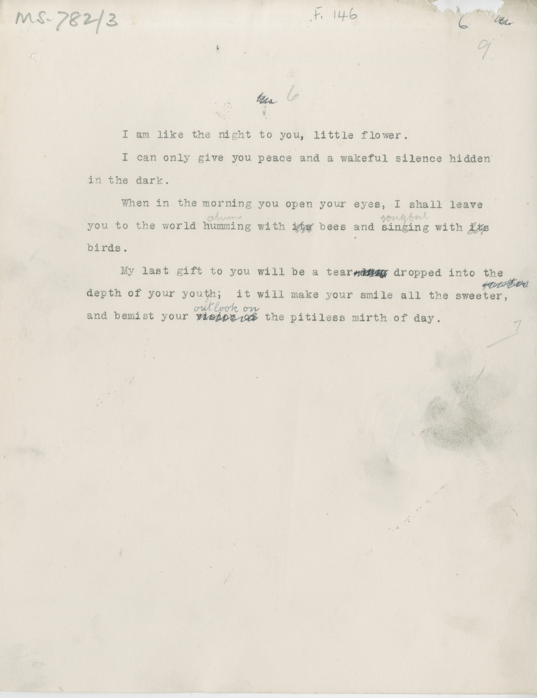

# MS 782/3

[F 146]

~~7.~~ ^6^ \
&nbsp;&nbsp;&nbsp;&nbsp;&nbsp;I am like the night to you, little flower. \
&nbsp;&nbsp;&nbsp;&nbsp;&nbsp;I can only give you peace and a wakeful silence hidden \
in the dark. \
&nbsp;&nbsp;&nbsp;&nbsp;&nbsp;When in the morning you open your eyes, I shall leave \
you to the world humming ^??^ with ~~its~~ bees and singing ^songful^ with ~~its~~ \
birds. \
&nbsp;&nbsp;&nbsp;&nbsp;&nbsp;My last gift to you will be a tear ~~drop~~ dropped into the \
depth of your youth; it will make your smile all the sweeter, ~~for others~~ \
and bemist your ~~vision of~~ ^outlook on^ the pitiless mirth of day.  

