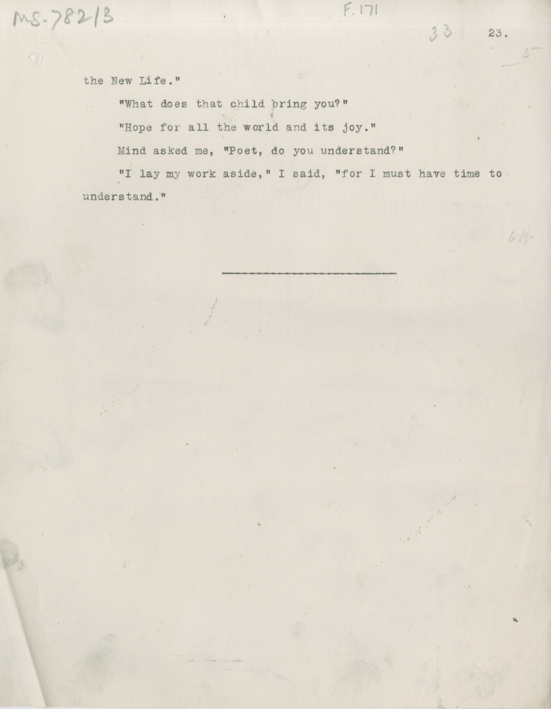

# MS 782/3

[F 171]

the New Life." \
&nbsp;&nbsp;&nbsp;&nbsp;&nbsp;"What does that child bring you?" \
&nbsp;&nbsp;&nbsp;&nbsp;&nbsp;"Hope for all the world and its joy." \
&nbsp;&nbsp;&nbsp;&nbsp;&nbsp;Mind asked me, "Poet, do you understand?" \
&nbsp;&nbsp;&nbsp;&nbsp;&nbsp;"I lay my work aside," I said, "for I must have time to \
understand."

