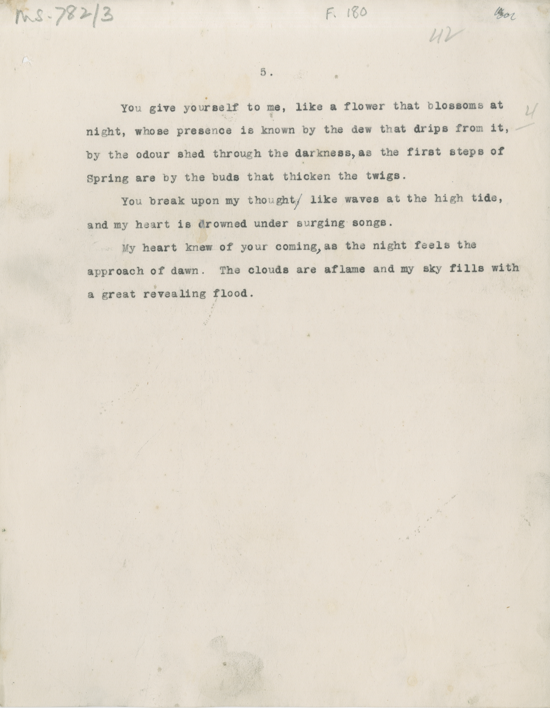

# MS 782/3

[F 180]

5. 

&nbsp;&nbsp;&nbsp;&nbsp;&nbsp;You give yourself to me, like a flower that blooms at \
night, whose presence is known by the dew that drips from it, [4/] \
by the odour shed through the darkness^,^ as the first steps of \
Spring are by the buds that thicken the twigs. \
&nbsp;&nbsp;&nbsp;&nbsp;&nbsp;You break upon my thought ~~.~~ like waves at the high tide, \
and my heart is drowned under surging songs. \
&nbsp;&nbsp;&nbsp;&nbsp;&nbsp;My heart knew of your coming^,^ as the night feels the \
approach of dawn. The clouds are aflame and my sky fills with \
a great revealing flood.

