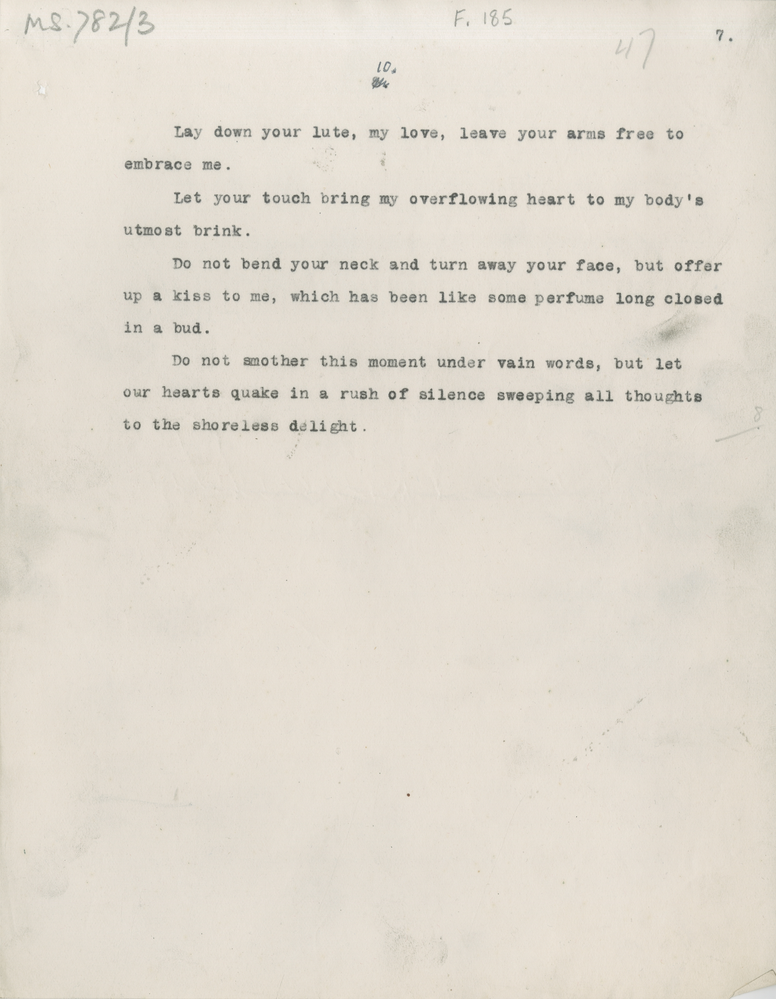

# MS 782/3 

[F 185]

~~8.~~ ^10^ 

&nbsp;&nbsp;&nbsp;&nbsp;&nbsp;Lay down your lute, my love, leave your arms free to \
embrace me. \
&nbsp;&nbsp;&nbsp;&nbsp;&nbsp;Let your touch bring my overflowing heart to my body's \
utmost brink. \
&nbsp;&nbsp;&nbsp;&nbsp;&nbsp;Do not bend your neck and turn away your face, but offer \
up a kiss to me, which has been like some perfume long closed \
in a bud. \
&nbsp;&nbsp;&nbsp;&nbsp;&nbsp;Do not smother this moment under vain words, but let \
our hearts quake in a rush of silence sweeping all thoughts \
to the shoreless delight. 

