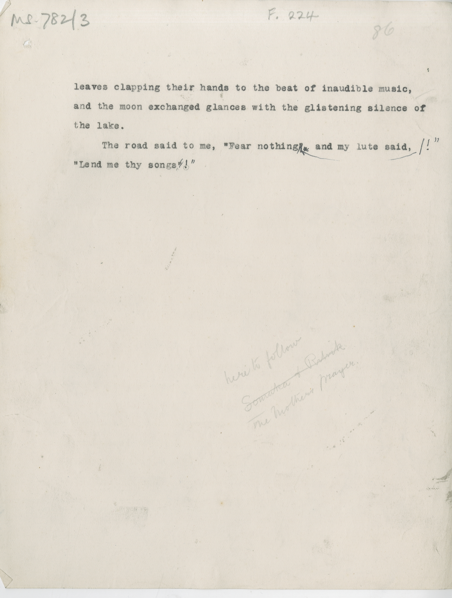

# MS 782/3

[F 224]

leaves clapping their hands to the beat of inaudible music, \
and the moon exchanged glances with the glistening silence of \
the lake. \
&nbsp;&nbsp;&nbsp;&nbsp;&nbsp;The road said to me, "Fear nothing ~~!?~~ ^!"^  and my lute said, \
"Lend me thy songs ~~"~~ ^!"^
pencil notes: here to follow \
~~Somalea of Ralnik?~~ \
The mother's Prayer 
 

