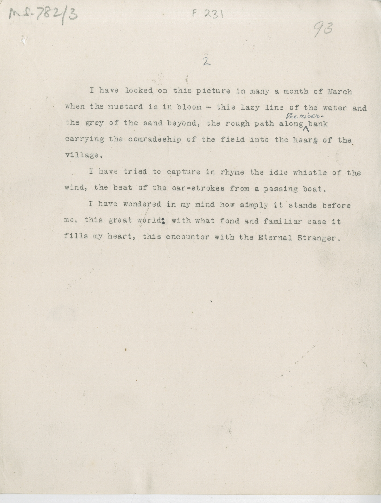

# MS 782/3

[F 231]

^2^

&nbsp;&nbsp;&nbsp;&nbsp;&nbsp;I have looked on this picture in many a month of March \
when the mustard is in bloom - this lazy line of the water and \
the grey of the sand beyond, the rough path along ^the river-^ bank \
carrying the comradeship of the field into the heart of the \
village. \
&nbsp;&nbsp;&nbsp;&nbsp;&nbsp;I have tried to capture in rhyme the idle whistle of the \
wind, the beat of the oar-strokes from a passing boat. \
&nbsp;&nbsp;&nbsp;&nbsp;&nbsp;I have wondered in my mind how simply it stands before \
me, this great world^:^ with what fond and familiar ease it \
fills my heart, this encounter with the Eternal Stranger.

