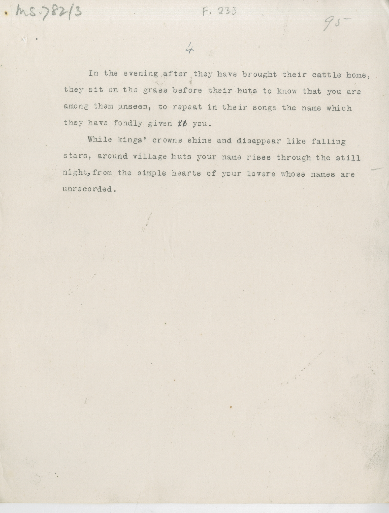

# MS 782/3

[F 233]

^4^

&nbsp;&nbsp;&nbsp;&nbsp;&nbsp;In the evening after they have brought their cattle home, \
they sit on the grass before their huts to know that you are \
among them unseen, to repeat in their songs the name which \
they have fondly given ~~to~~ you. \
&nbsp;&nbsp;&nbsp;&nbsp;&nbsp;While kings' crowns shine and disappear like falling \
stars, around village huts your name rises through the still \
night^,^ from the simple hearts of your lovers whose names are \
unrecorded.  

