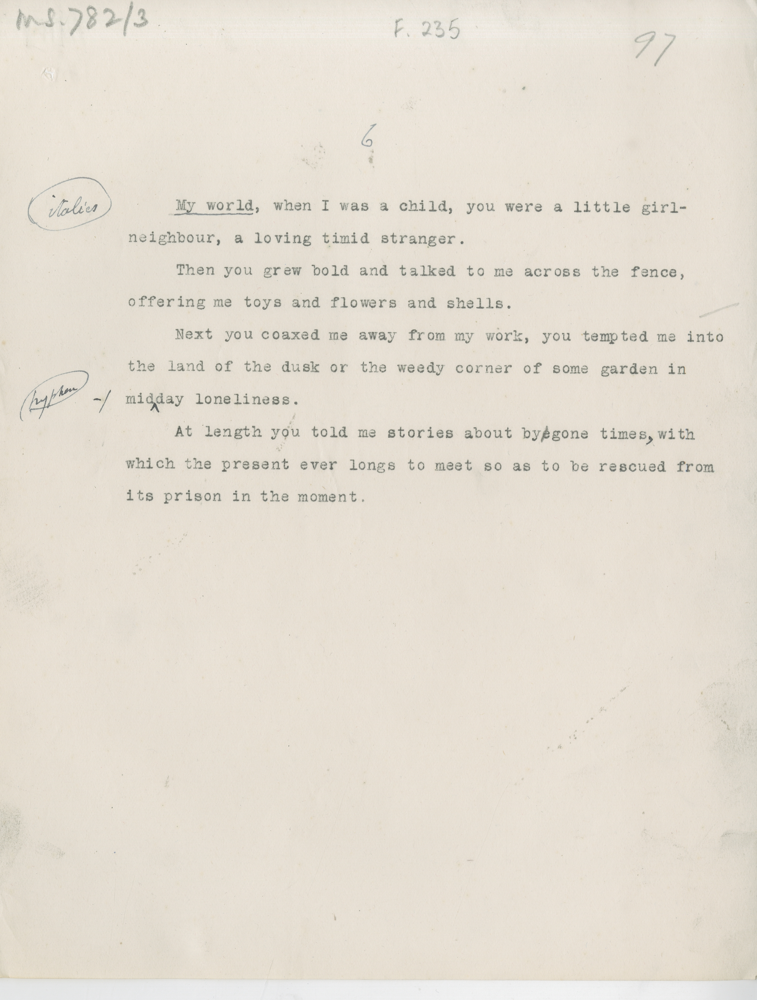

# MS 782/3

[F 235]

^6^

&nbsp;&nbsp;&nbsp;&nbsp;&nbsp;[italics] My world, [underline] when I was a child, you were a little girl- \
neighbour, a living timid stranger. \
&nbsp;&nbsp;&nbsp;&nbsp;&nbsp;Then you grew bold and talked to me across the fence, \
offering me toys and flowers and shells. \
&nbsp;&nbsp;&nbsp;&nbsp;&nbsp;Next you coaxed me away from my work, you tempted me into \
the land of the dusk of the weedy corner of some garden in \
mid^-^day loneliness. \
&nbsp;&nbsp;&nbsp;&nbsp;&nbsp;At length you told me stories about by~~e~~gone times^,^ with \
which the present ever longs to meet so as to be rescued from \
its prison in the moment. 

