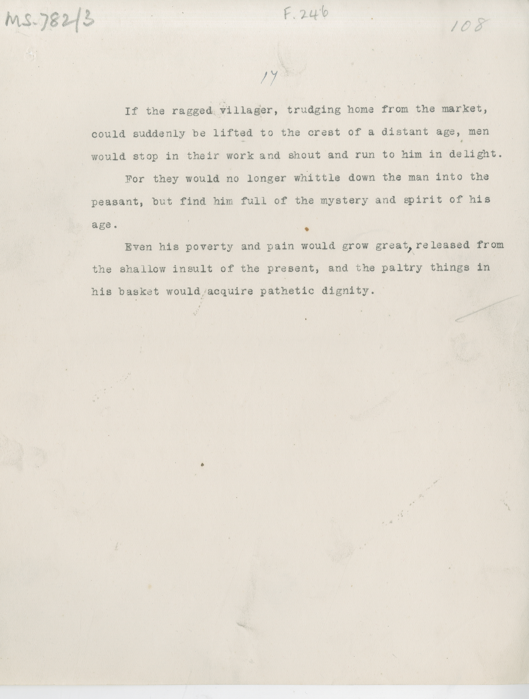

# MS 782/3

[F 246]

^17^

&nbsp;&nbsp;&nbsp;&nbsp;&nbsp;If the ragged villager, trudging home from the market, \
could suddenly be lifted to the crest of a distant age, men \
would stop in their work and shout and run to him in delight. \
&nbsp;&nbsp;&nbsp;&nbsp;&nbsp;For they would no longer whittle down the man into the \
peasant, but find him full of the mystery and spirit of his \
age. \
&nbsp;&nbsp;&nbsp;&nbsp;&nbsp;Even his poverty and pain would grow great^,^ released from \
the shallow insult of the present, and the paltry things in \
his basket would acquire pathetic dignity. 

