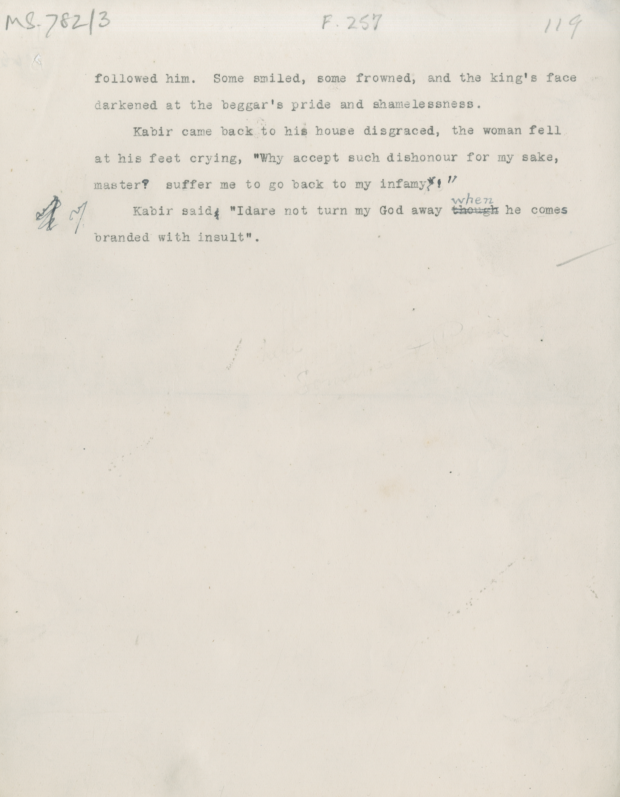

# MS 782/3

[F 257]

followed him. Some smiled, some frowned, and the king's face \
darkened at the beggar's pride and shamelessness. \
&nbsp;&nbsp;&nbsp;&nbsp;&nbsp;Kabir came back to his house disgraced, the woman fell \
at his feet crying, "Why accept such dishonour for my sake, \
master? suffer me to go back to my infamy ~~"~~ ^!"^ \
&nbsp;&nbsp;&nbsp;&nbsp;&nbsp;Kabit said ~~,~~ "Idare not turn my God away ~~though~~ ^when^ he comes \
branded with insult". 

