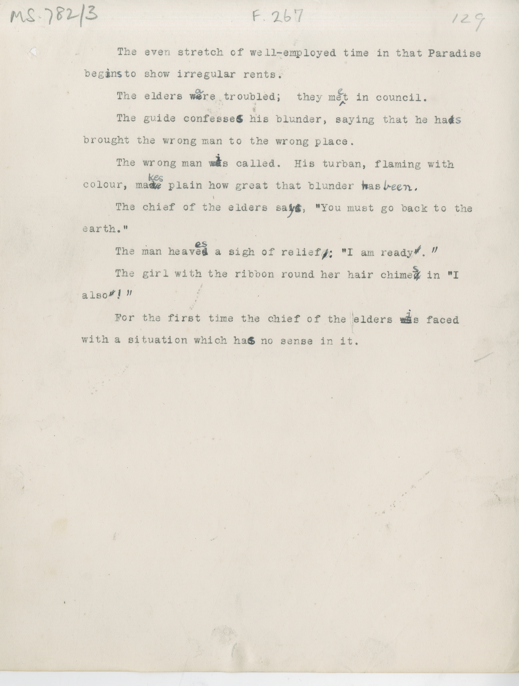

# MS 782/3

[F 267]

&nbsp;&nbsp;&nbsp;&nbsp;&nbsp;The even stretch of well-employed time in that Paradise \
beg~~a~~^i^n^s^ to show irregular rents. \
&nbsp;&nbsp;&nbsp;&nbsp;&nbsp;The elders ~~we~~^a^re troubled; they me^e^t in council. \
&nbsp;&nbsp;&nbsp;&nbsp;&nbsp;The guide confesse~~d~~^s^ his blunder, saying that he ha~~s~~^s^ \
brought the wrong man to the wrong place. \
&nbsp;&nbsp;&nbsp;&nbsp;&nbsp;The wrong man ~~wa~~^i^s called. His turban, flaming with \
colour, ma~~de~~^kes^ plain how great that blunder ~~w~~^h^as ^been^. \
&nbsp;&nbsp;&nbsp;&nbsp;&nbsp;The chief of the elders sa~~id~~^ys^, "You must go back to the \
earth." \
&nbsp;&nbsp;&nbsp;&nbsp;&nbsp;The man heave~~d~~^es^ a sigh of relief ~~,~~ ^:^ "I am ready ~~"~~ .^"^ \
&nbsp;&nbsp;&nbsp;&nbsp;&nbsp;The girl with the ribbon round her hair chime~~d~~^s^ in "I \
also ~~"~~ ^! "^ \
&nbsp;&nbsp;&nbsp;&nbsp;&nbsp;For the first time the chief of the elders ~~wa~~^i^s faced \
with a situation which ha~~d~~^s^ no sense in it. 

