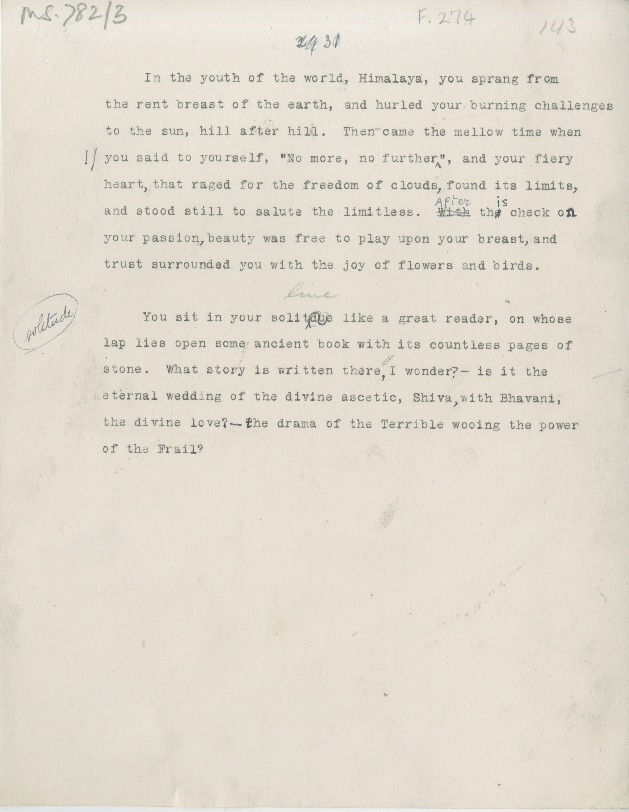

# MS 782/3

[F 274]

~~29~~ ^31^ \
&nbsp;&nbsp;&nbsp;&nbsp;&nbsp;In the youth of the world, Himalaya, you sprang from \
the rent breast of the earth, and hurled your burning challenges \
to the sun, hill after hill. Then came the mellow time when \
you said to yourself, "No more, no further^!^", and your fiery \
heart^,^ that raged for the freedom of clouds^,^ found its limits^,^ \
and stood still to salute the limitless. ~~With~~ ^After^ th~~e~~^is^ check o^n^ \
your passion^,^ beauty was free to play upon your breast^,^ and \
trust surrounded you with the joy of flowers and birds. \
[line] \
&nbsp;&nbsp;&nbsp;&nbsp;&nbsp;You sit in your ~~solitdue~~ ^solitude^ like a great reader, on whose \
lap lies open some ancient book with its countless pages of \
stone. What story is written there, I wonder^? -^ is it the \
eternal wedding of the divine ascetic, Shiva^,^ with Bhavani, \
the divine love^? -^ ^t^he drama of the terrible wooing the power \
of the Frail? 

