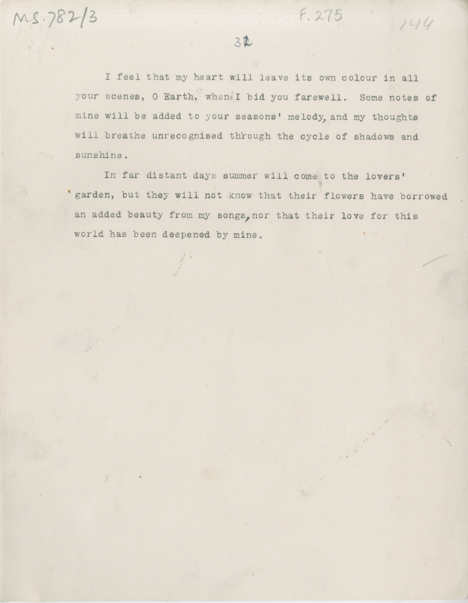

# MS 782/3

[F 275]

~~30~~ ^32^ \
&nbsp;&nbsp;&nbsp;&nbsp;&nbsp;I feel that my heart will leave its own colour in all \
your scenes, O Earth, when I bid you farewell. Some notes of \
mine will be added to your seasons' melody^,^ and my thoughts \
will breathe unrecognised through the cycle of shadows and \
sunshine. \
&nbsp;&nbsp;&nbsp;&nbsp;&nbsp;In far distant days summer will come to the lovers' \
garden, but they will not know that their flowers have borrowed \
an added beauty from my songs^,^ nor that their love for this \
world has been deepened by mine.

