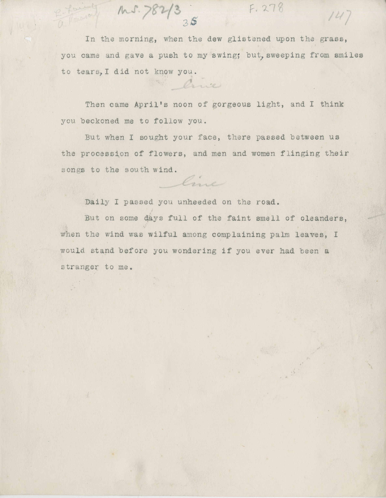

# MS 782/3

[F 278]

^35^ 

&nbsp;&nbsp;&nbsp;&nbsp;&nbsp;In the morning, when the dew glistened upon the grass, \
you came and gave a push to my swing^;^ but^,^ sweeping from smiles \
to tears^,^ I did not know you. \
[line] \
&nbsp;&nbsp;&nbsp;&nbsp;&nbsp;Then came April's noon of gorgeous light, and I think \
you beckoned me to follow you. \
&nbsp;&nbsp;&nbsp;&nbsp;&nbsp;But when I sought your face, there passed between us \
the procession of flowers, and men and women flinging their \
songs to the south wind. \
[line] \
&nbsp;&nbsp;&nbsp;&nbsp;&nbsp;Daily I passed you unheeded on the road. \
&nbsp;&nbsp;&nbsp;&nbsp;&nbsp;But on some days full of the faint smell of cleanders, \
when the wind was wilful among complaining palm leaves, I \
would stand before you wondering if you ever had been a \
stranger to me. 

