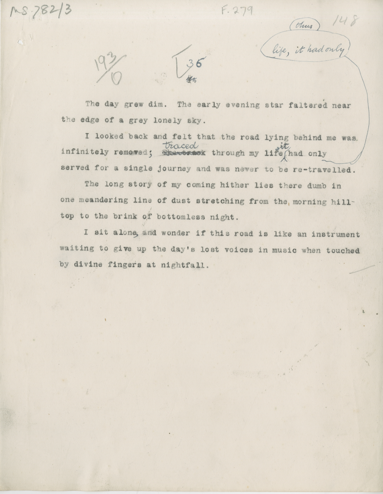

# MS 782/3

[F 279]

^[^ [193/0] ^36^ 

&nbsp;&nbsp;&nbsp;&nbsp;&nbsp;The day grew dim. The early evening star faltered near \
the edge of a grey lonely sky. \
&nbsp;&nbsp;&nbsp;&nbsp;&nbsp;I looked back and felt the road lying behind me ws \
infinitely removed^;^ ~~the track?~~ ^traced^ through my life ^it^ had only (thus?) \
served for a single journey and was never to be re-travelled. \
&nbsp;&nbsp;&nbsp;&nbsp;&nbsp;The long story of my coming hither lies there dumb in \
one meandering line of dust stretching from the morning hill \
top to the brink of bottomless night. \
&nbsp;&nbsp;&nbsp;&nbsp;&nbsp;I sit alone^,^ and wonder if this road is like an instrument \
waiting to give up the day's lost voices in music when touched \
by divine fingers at nightfall. 

