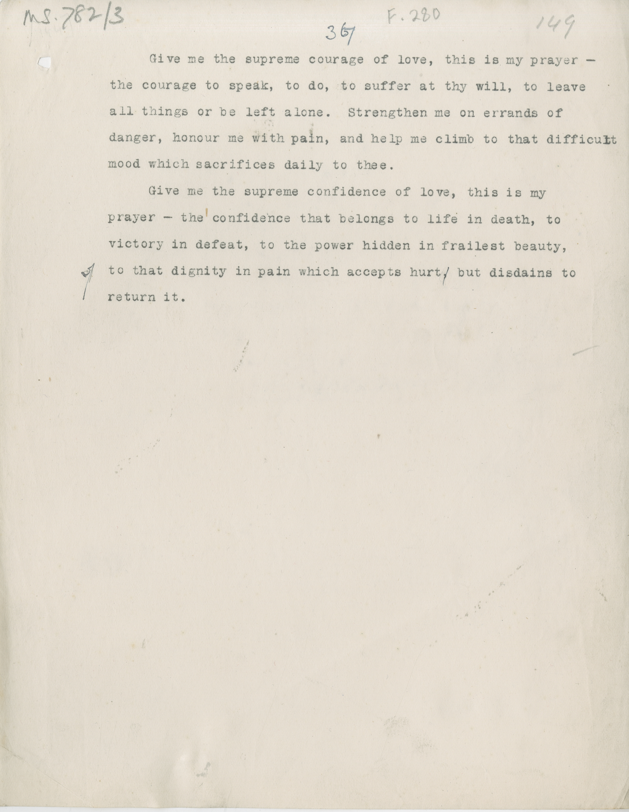

# MS 782/3

[F 280]

~~36~~ ^37^

&nbsp;&nbsp;&nbsp;&nbsp;&nbsp;Give me the supreme courage of love, this is my prayer ^-^ \
the courage to speak, to do, to suffer at thy will, to leave \
all things or to be left alone. Strengthen me on errands of \
danger; honour me with pain, and help me climb to that difficult \
mood which sacrifices daily to thee. \
&nbsp;&nbsp;&nbsp;&nbsp;&nbsp;Give me the supreme confidence of love, this is my \
prayer^-^ the confidence that belongs to life in death, to \
victory in defeat, to the power hidden in frailest beauty, \
to that dignity in pain which accepts hurt ~~,~~ but disdains to \
return it. 

