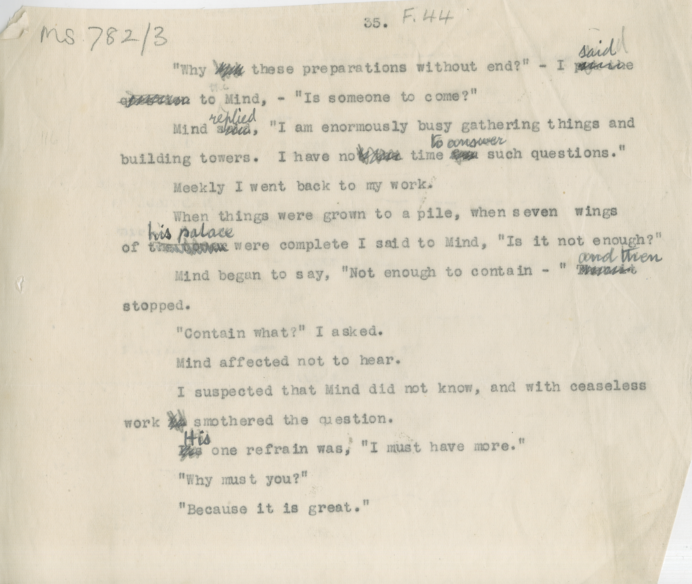

# MS 782/3

[F 44]

35. 

&nbsp;&nbsp;&nbsp;&nbsp;&nbsp;"Why ~~?~~ these preparations without end?" - I ~~put the~~ ^said^ \
~~question~~ to Mind - "Is someone to come?" \
&nbsp;&nbsp;&nbsp;&nbsp;&nbsp;Mind ~~said~~ ^replied^, "I am enormously busy gathering things and \
building towers. I have no ~~t the~~ time ~~for~~ ^to answer^ such questions". \
&nbsp;&nbsp;&nbsp;&nbsp;&nbsp;Meekly I went back to my work. \
&nbsp;&nbsp;&nbsp;&nbsp;&nbsp;When things were grown to a pile, when seven wings \
of ~~the tower~~ ^his palace^ were complete I said to Mind, "Is it not enough?" \
&nbsp;&nbsp;&nbsp;&nbsp;&nbsp;Mind began to say, "Not enough to contain-" ~~Then it~~ ^and then^ \
stopped. \
&nbsp;&nbsp;&nbsp;&nbsp;&nbsp;"Contain what?" I asked. \
&nbsp;&nbsp;&nbsp;&nbsp;&nbsp;Mind affected not to hear. \
&nbsp;&nbsp;&nbsp;&nbsp;&nbsp;I suspected that Mind did not know, and with ceaseless \
work ~~it~~ smothered the question. \
&nbsp;&nbsp;&nbsp;&nbsp;&nbsp;~~Its~~ His one refrain was, "I must have more". \
&nbsp;&nbsp;&nbsp;&nbsp;&nbsp;"Why must you?" \
&nbsp;&nbsp;&nbsp;&nbsp;&nbsp;"Because it is great". 

