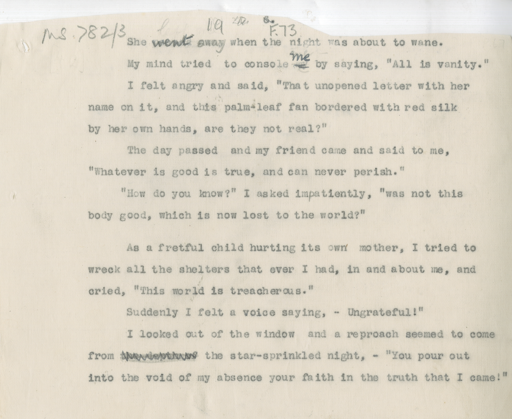

# MS 782/3

[F 73]

~~6.~~ ^19^ 

&nbsp;&nbsp;&nbsp;&nbsp;&nbsp;She ~~?~~ ^went^ away when the night was about to wane. \
&nbsp;&nbsp;&nbsp;&nbsp;&nbsp;My mind tried to console ~~my~~ ^me^ by saying, "All is vanity". \
&nbsp;&nbsp;&nbsp;&nbsp;&nbsp;I felt angry and said, "That unopened letter with her \
name on it, and this palm-leaf fan bordered with red silk \
by her own hands, are they not real?" \
&nbsp;&nbsp;&nbsp;&nbsp;&nbsp;The day passed and my friend came and said to me, \
"Whatever is good is true, and can never perish". \
&nbsp;&nbsp;&nbsp;&nbsp;&nbsp;"How do you know?" I asked impatiently, "was not this \
body good which is now lost to the world?"" 

&nbsp;&nbsp;&nbsp;&nbsp;&nbsp;As a fretful child hurting its own mother, I tried to \
wreck all the shelters that ever I had, in and about me, and \
cried, "This world is treacherous". \
&nbsp;&nbsp;&nbsp;&nbsp;&nbsp;Suddenly I felt a voice saying - "Ungrateful!" \
&nbsp;&nbsp;&nbsp;&nbsp;&nbsp;I looked out of the window^,^ and a reproach seemed to come \
from ~~the depth of~~ star-sprinkled night, - "You pour out \
into the void of my absence your faith in the truth that I came!"

