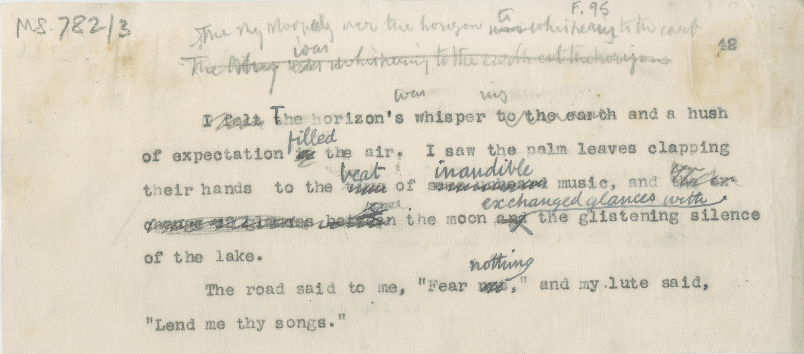

# MS 782/3

[F 95]

[pencil notes?]

&nbsp;&nbsp;&nbsp;&nbsp;&nbsp;~~I felt~~ ~~t~~^T^he horizon's whisper ~~to the earth~~ and a hush \
of expectation ~~in~~ ^filled^ the air. I saw the palm leaves clapping \
their hands to the ~~time~~ ^beat^ of ~~some unheard~~ ^inaudible^ music, and ~~the ?~~ \
~~change of glances between~~ the moon ~~and~~ ^exchanged glances with^ the glistening silence \
of the lake. \
&nbsp;&nbsp;&nbsp;&nbsp;&nbsp;The road said to me, "Fear ~~not~~ ^nothing^,"  and my lute said, \
"Lend me thy songs."

