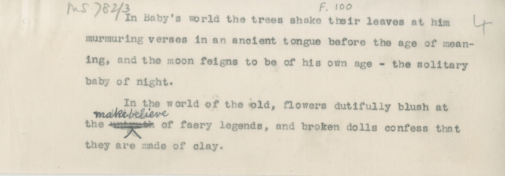

# MS 782/3

[F 100]

&nbsp;&nbsp;&nbsp;&nbsp;&nbsp;In Baby's world the trees shake their leaves at him [4] \
murmuring verses in an ancient tongue before the age of mean- \
ing, and the moon feig^n^s to be of his own age - the solitary \
baby of night. \
&nbsp;&nbsp;&nbsp;&nbsp;&nbsp;In the world of the old, flowers dutifully blush at \
the ~~untruth~~ ^make-believe^ of faery legends, and broken dolls confess that \
they are made of clay.

