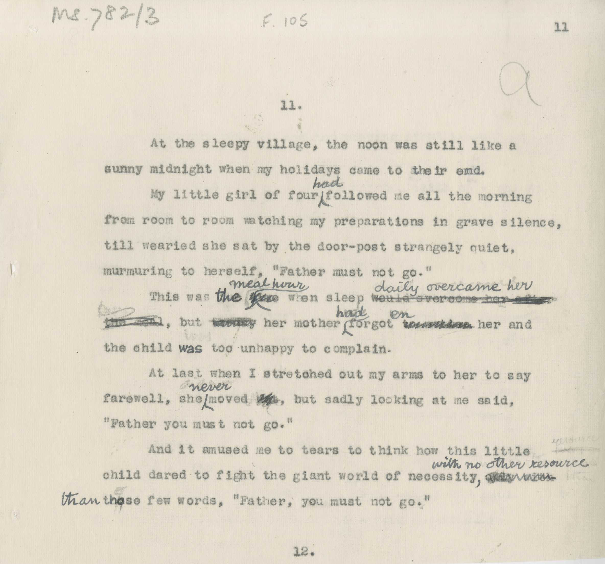

# MS 782/3

[F 105]

11. [a]

&nbsp;&nbsp;&nbsp;&nbsp;&nbsp;At the sleepy village, the moon was still like a \
sunny midnight when my holidays came to their end. \
&nbsp;&nbsp;&nbsp;&nbsp;&nbsp;My little girl of four ^had^ followed me all the morning \
from room to room watching my preparations in grave silence, \
till wearied she sat by the door-post strangely quiet, \
murmuring to herself, "Father must not go." \
&nbsp;&nbsp;&nbsp;&nbsp;&nbsp;This was ~~?~~ ^the meal hour^ when sleep ~~would overcome her effort?~~ ^daily overcame her^ \
~~the meal~~, but ~~?~~ her mother ^had^ forgot^en^ ~~to ?~~ her and \
the child was too unhappy to complain. \
&nbsp;&nbsp;&nbsp;&nbsp;&nbsp;At last when I stretched out my arms to her to say \
farewell, she ^never^ moved ~~not~~, but sadly looking at me said, \
"Father you must not go." \
&nbsp;&nbsp;&nbsp;&nbsp;&nbsp;And it amused me to tears to think how this little \
child dared to fight the giant world of necessity ~~only with~~ ^, with no other \
resource^ \
^than^ th~~e~~^o^se few words, "Father, you must not go."

12.

