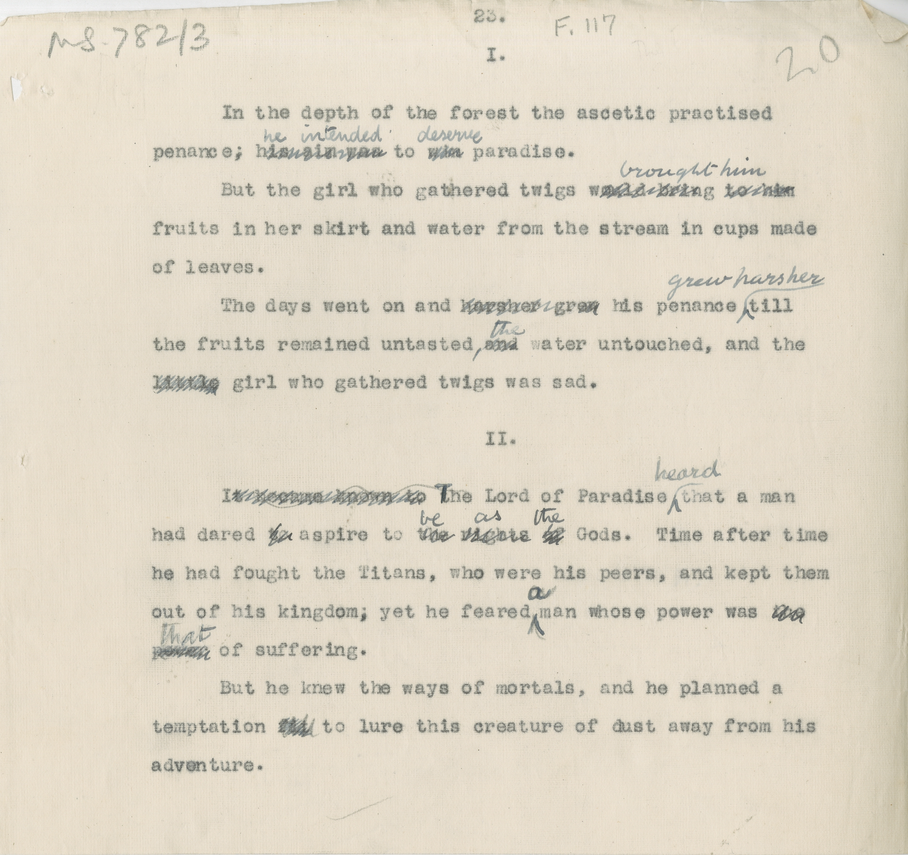

# MS 782/3

[F 117]

23.

I.

&nbsp;&nbsp;&nbsp;&nbsp;&nbsp;In the depths of the forest the ascetic practised \
penance^;^ ~~his aim was~~ ^he intended^ to ^deserve^ paradise. \
&nbsp;&nbsp;&nbsp;&nbsp;&nbsp;But the girl who gathered twigs ~~would bring to him~~ ^brought him^ \
fruits in her skirt and water from the stream in cups made \
of leaves. \
&nbsp;&nbsp;&nbsp;&nbsp;&nbsp;The days went on and ~~harsher grew~~ his penance ^grew harsher^ till \
the fruits remained untasted^,^ ~~and~~ ^the^ water untouched, and the \
~~little~~ girl who gathered twigs was sad. 

II.

&nbsp;&nbsp;&nbsp;&nbsp;&nbsp;~~It became known to t~~ ^T^he Lord of Paradise ^heard^ that a man \
had dared ~~to~~ aspire to ~~the~~ ^be^ ~~rights of~~ ^as the^ Gods. Time after time \
he had fought the Titans, who were his peers, and kept them \
out of his kingdom; yet he feared ^a^ man whose power was ~~the~~ \
~~power~~ ^that^ of suffering. \
&nbsp;&nbsp;&nbsp;&nbsp;&nbsp;But he knew the ways of mortals, and he planned a \
temptation ~~fit~~ to lure this creature of dust away from his \
adventure. 

