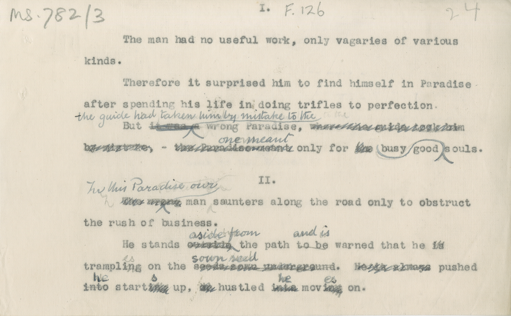

# MS 782/3

[F 126]

I. 

&nbsp;&nbsp;&nbsp;&nbsp;&nbsp;The man had no useful work, only vagaries of various \
kinds. \
&nbsp;&nbsp;&nbsp;&nbsp;&nbsp;Therefore it surprised him to find himseslf in Paradise \
after spending his life in doing trifles to perfection. \
&nbsp;&nbsp;&nbsp;&nbsp;&nbsp;But ~~it was a~~ ^the guide had taken him by mistake to the^ wrong Paradise. ~~where the guide took him~~ \
~~by mistake,~~ - ~~the Paradise meant~~ ^one meant^ only for ~~the~~ ~~busy~~ good, ^busy^ souls. 

II. 

&nbsp;&nbsp;&nbsp;&nbsp;&nbsp;~~The wrong~~ ^In this Paradise our^ man saunters along the road only to obstruct \
the rush of business. \
&nbsp;&nbsp;&nbsp;&nbsp;&nbsp;He stands ~~outside~~ ^aside from^ the path ~~to be~~ ^and is^ warned that he ~~is~~ \
trampl~~ing~~^es^ on ~~seeds sown underground~~ ^sown seed^. ~~He is always pushed \
~~into~~ ^he^ start ~~ing~~ ^s^ up, ~~or~~ hustled ~~into~~ ^he^ mov ~~ing~~ ^es^ on.

