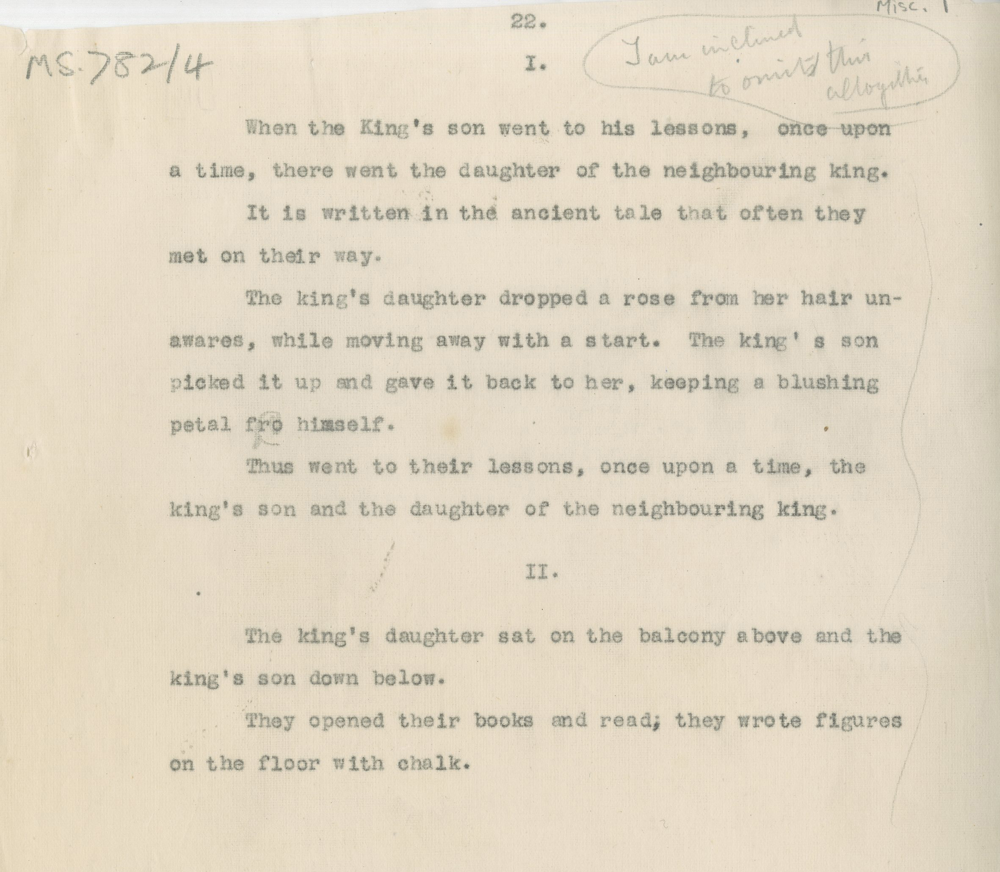

#MS 782/4

[Misc 1]

22. 

I. [I am inclined to omit this altogether]

&nbsp;&nbsp;&nbsp;&nbsp;&nbsp;When the King's son went to his lessons, once upon \
a time, there went the daughter of the neighbouring king. \
&nbsp;&nbsp;&nbsp;&nbsp;&nbsp;It is written in the ancient tale that often they \
met on their way. \
&nbsp;&nbsp;&nbsp;&nbsp;&nbsp;The king's daughter dropped a rose from her hair un- \
awares, while moving away with a start. The king's son \
picked it up and gave it back to her, keeping a blushing \
petal f~~r~~o^r^ himself. \
&nbsp;&nbsp;&nbsp;&nbsp;&nbsp;Thus went their lessons, once upon a time, the \
king's son and the daughter of the neighbouring king. 

II. 

&nbsp;&nbsp;&nbsp;&nbsp;&nbsp;The king's daughter sat on the balcony above and the \
king's son down below. \
&nbsp;&nbsp;&nbsp;&nbsp;&nbsp;They opened their books and read^;^ they wrote figures \
on the floor with chalk. 

