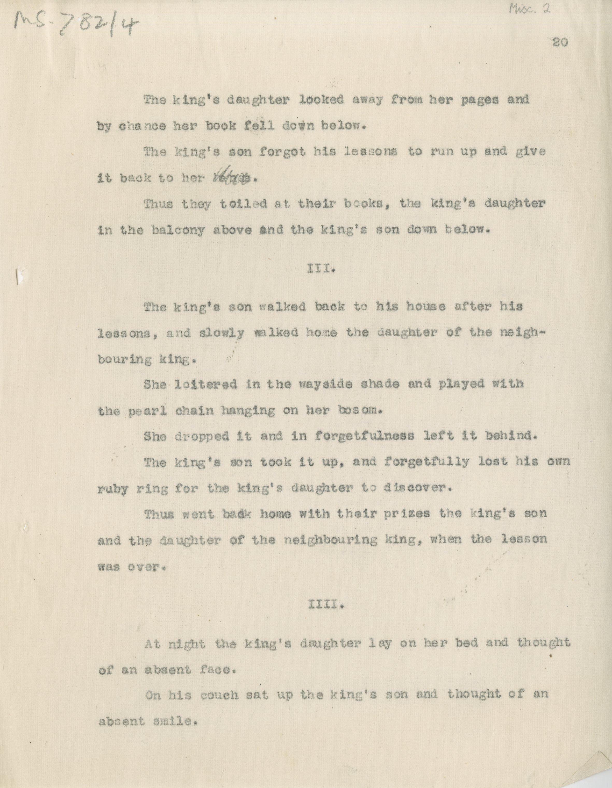

#MS 782\4

[Misc 2]

&nbsp;&nbsp;&nbsp;&nbsp;&nbsp;The king's daughter looked away from her pages and \
by chance her book fell down below. \
&nbsp;&nbsp;&nbsp;&nbsp;&nbsp;The king's son forgot his lessons to run up and give \
it back to her ~~hands~~. \
&nbsp;&nbsp;&nbsp;&nbsp;&nbsp;Thus they toiled at their books, the king's daughter \
in the balcony above and the king's son down below. 

III. 

&nbsp;&nbsp;&nbsp;&nbsp;&nbsp;The king's son walked back to his house after his \
lessons, and slowly walked home the daughter of the neigh- \
bouring king. \
&nbsp;&nbsp;&nbsp;&nbsp;&nbsp;She loitered in the waysaide shade and played with \
the pearl chain hanging on her bosom. \
&nbsp;&nbsp;&nbsp;&nbsp;&nbsp;She dropped it and in forgetfulness left it behind. \
&nbsp;&nbsp;&nbsp;&nbsp;&nbsp;The king's son took it up, and forgetfully lost his own \
ruby ring for the king's daughter to discover. \
&nbsp;&nbsp;&nbsp;&nbsp;&nbsp;Thus went back home with their prizes the king's son \
and the daughter of the neighbouring king, when the lesson \
was over. 
 
IIII. 

&nbsp;&nbsp;&nbsp;&nbsp;&nbsp;At night the king's daughter lay on her bed and thought \
of an absent face. \
&nbsp;&nbsp;&nbsp;&nbsp;&nbsp;On his couch sat up the king's son and thought of an \
absent smile. 

