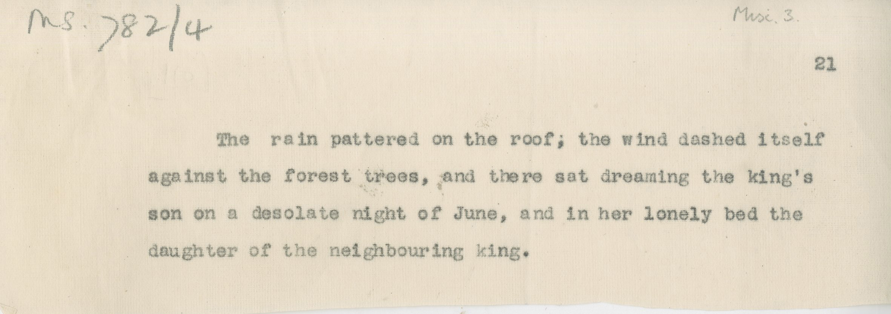

# MS 782/4

[Misc 3]

&nbsp;&nbsp;&nbsp;&nbsp;&nbsp;The rain pattered on the roof; the wind dashed itself \
against the forest trees, and there sat dreaming the king's \
son on a desolate night of June, and in her lonely bed the \
daughter of the neighbouring king. 

