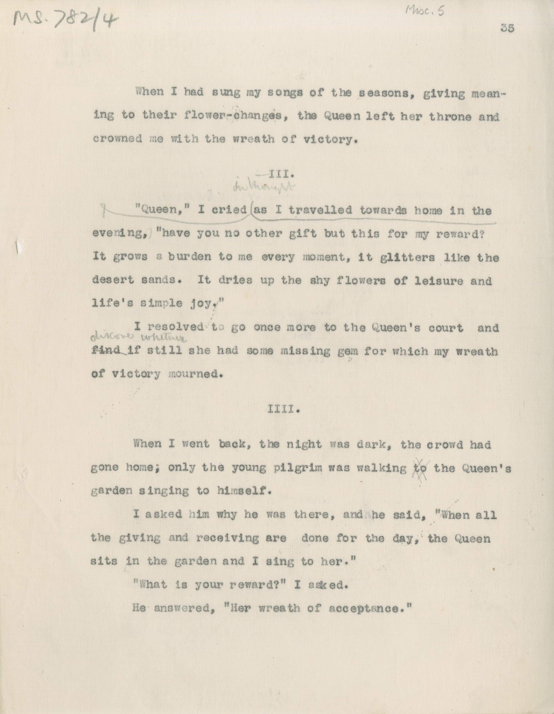

# MS 782/4

[Misc 5]

&nbsp;&nbsp;&nbsp;&nbsp;&nbsp;When I had sung my songs of the season, giving mean- \
ing to their flower-changes, the Queen left her throne and \
crowned me with the wreath of victory. 

III.

&nbsp;&nbsp;&nbsp;&nbsp;&nbsp;^As I travelled towards home in the evening^ "Queen," I cried ~~as I travelled towards home in the \
evening~~, "have you no other gift but this for my reward? \
It grows a burden to me every moment, it glitters like the \
desert sands. It dries up the shy flowers of leisure and \
life's simple joy." \
&nbsp;&nbsp;&nbsp;&nbsp;&nbsp;I resolved to go once more to the Queen's court and \
~~find if~~ ^discover whether^ still she had some missing gem for which my wreath \
of victory mourned. 

IIII. 

&nbsp;&nbsp;&nbsp;&nbsp;&nbsp;When I went back, the night was dark, the crowd had \
gone home; only the young pilgrim was walking ~~to~~ the Queen's \
garden singing to himself. \
&nbsp;&nbsp;&nbsp;&nbsp;&nbsp;I asked him why he was there, and he said, "When all \
the giving and receiving are done for the day, the Queen \
sits in the garden and I sing to her." \
&nbsp;&nbsp;&nbsp;&nbsp;&nbsp;"What is your reward?" I asked. \
&nbsp;&nbsp;&nbsp;&nbsp;&nbsp;He answered, "Her wreath of acceptance."

