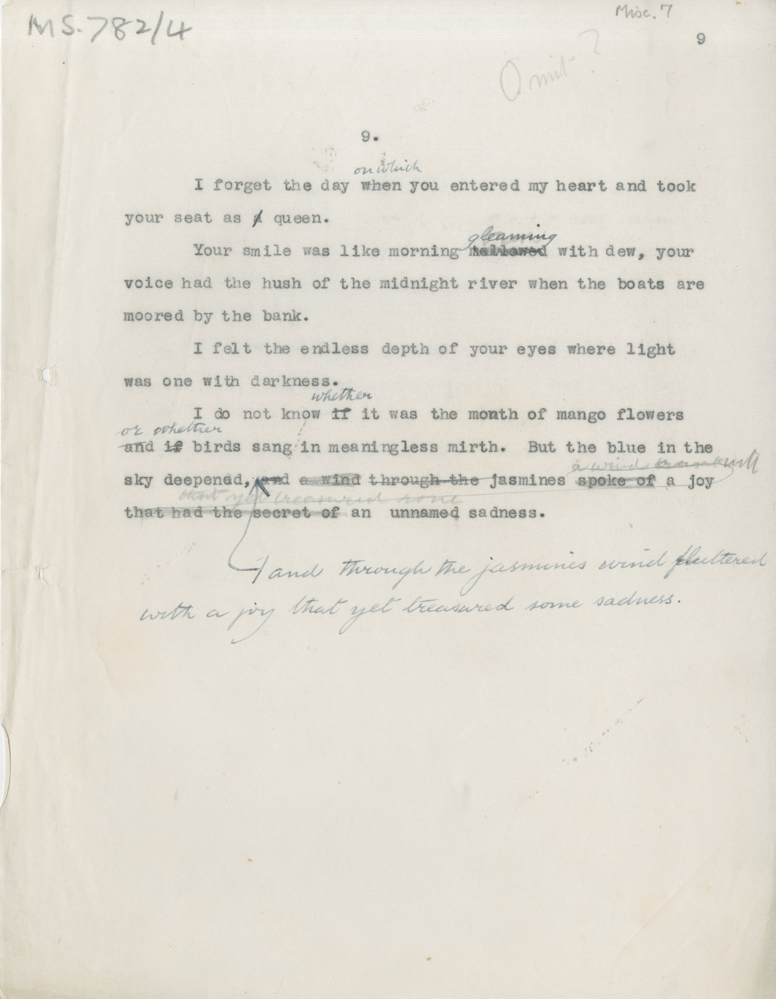

# MS 782/4

[Misc 7]

9. [omit?]

&nbsp;&nbsp;&nbsp;&nbsp;&nbsp;I forget the day ~~when~~ ^on which^ you entered my heart and took \
your seat as ~~a~~ queen. \
&nbsp;&nbsp;&nbsp;&nbsp;&nbsp;Your smile was like morning ~~mellowed~~ ^gleaming^ with dew, your \
voice had the hush of the midnight river when the boats are \
moored by the bank. \
&nbsp;&nbsp;&nbsp;&nbsp;&nbsp;I felt the endless depth of your eyes where light \
was one with darkness. \
&nbsp;&nbsp;&nbsp;&nbsp;&nbsp;I do not know ~~if~~ ^whether^ it was the month of mango flowers \
and ~~if~~ ^or whether^ birds sang in meaningless mirth. But the blue in the \
sky deepened, ~~and a wind through the jsamines spoke of a joy \
that had the secret of an unnamed sadness.~~ \
^and through the jasmines wind fluttered \
with a joy that yet treasured some sadness. 

