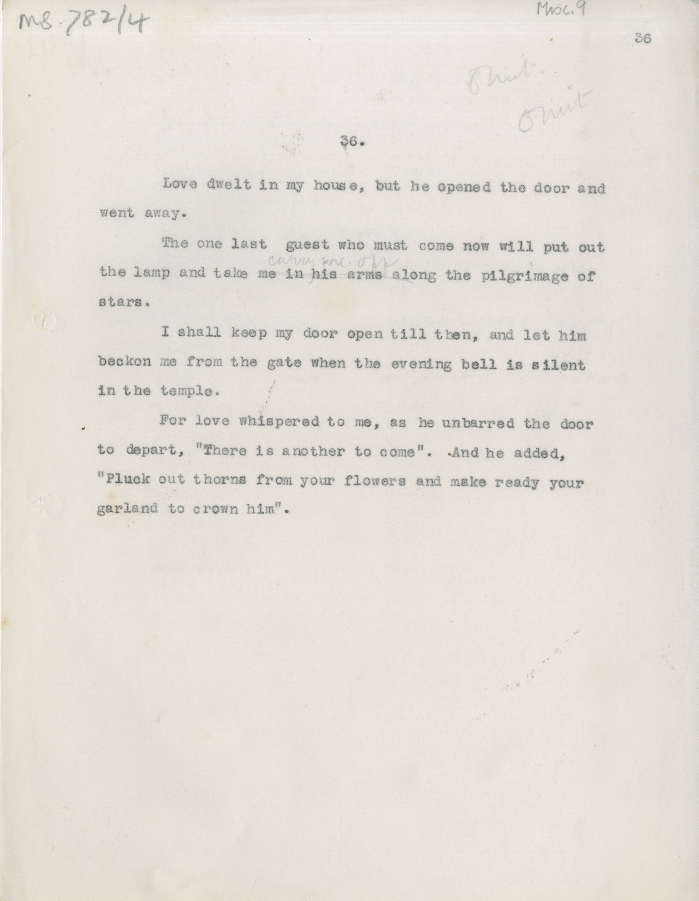

# MS 782/4

[Misc 9]

36. [? omit] 

&nbsp;&nbsp;&nbsp;&nbsp;&nbsp;Love dwelt in my house, but he opened the door and \
went away. \
&nbsp;&nbsp;&nbsp;&nbsp;&nbsp;The one last guest who must come now will put out \
the lamp and take ~~me in his arms along~~ ^carry me off^ the pilgrimage of \
stars. \
&nbsp;&nbsp;&nbsp;&nbsp;&nbsp;I shall keep my door open till then, and let him \
to depart, "There is another to come". And he added, \
"Pluck out thorns from your flowers and male ready your \
garland to crown him". 

